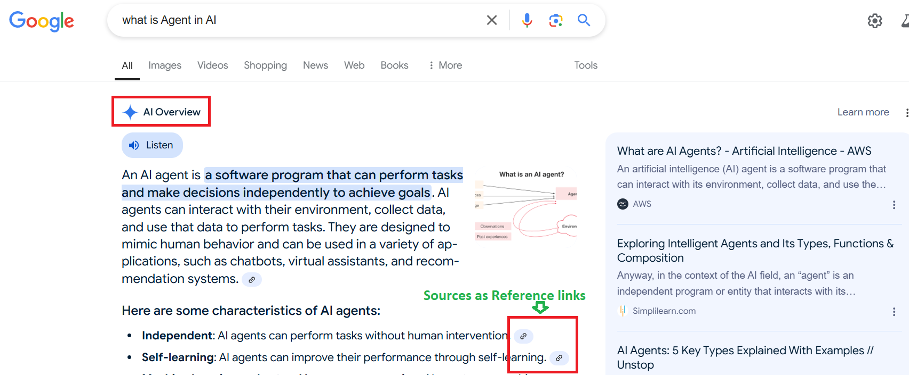
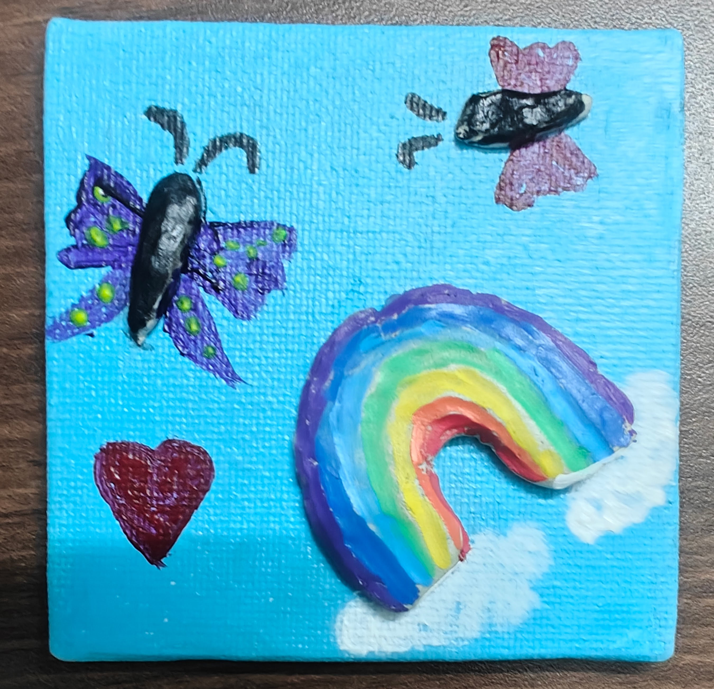
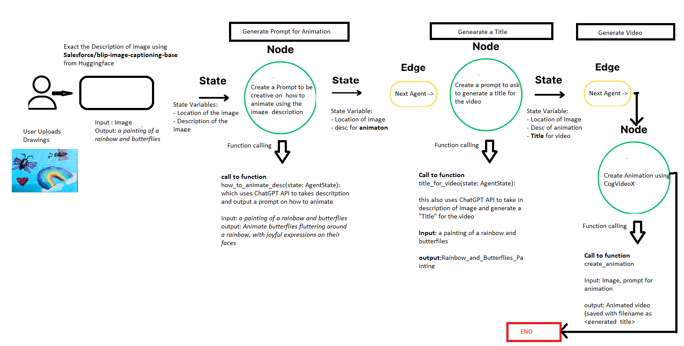
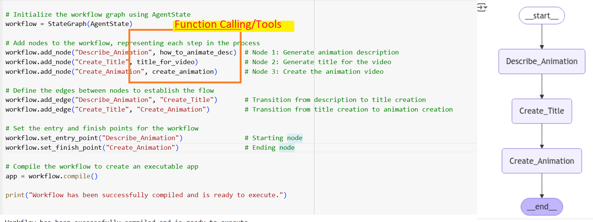

# **Agent in AI - What is that?**

### **Using LangGraph and CogVideoX for Image-to-Video Generation**

Ever since the buzz or hype or promise, whichever way we want to look at  Large Language Models, there has been developments to make it accessible and useable to solve real world and business problems. In that journey,  **RAG (Retrieval Augment Generation)** introduced  which means efficiently supplying dynamic real time data to augment the pretrained or finetuned LLM models and then allow the LLM to answer the query. This provided several advantages to help organizations use domain specific data dynamically and get meaningful responses with respect to context without the need to spend time and resources on training and finetuning LLM foundation models. if you had noticed google search results off late, you would find **AI Overview** with responses and the sources if had referred to get the response as links . This is similar to how Perplexity search works and all this is based on RAG.

Now, that RAG works great for chatbot kind of user interface and experience,   the next challenge was how do we Leverage , integrate, orchestrate these query and responses with existing/new  Enterprise applications with the ability to automate. This is where Agents fit in, it's a program with a objective of completing a specific task. 

Lets take this example:  I wanted to convert this drawing into an animated video using multimodal LLMs i.e the ones which can understand text and image

The steps would be 

1) identify an input image we want to Animate.

Input image:

2) Describe the drawing i.e Image to text descriptions -> *A painting of a rainbow and butterflies.*

3) Define how do we want the animation to be ->  *Animate butterflies fluttering around a rainbow.*

4) Perform the Animation -> image to video by CogVideoX - its pretrained generative model with text and image

5) Save it with a appropriate file name and play it.

Output is:

<video width="600" controls>
  <source src="./images/Rainbow and Butterflies_Painting.mp4" type="video/mp4">
Video
</video>

[Watch the video on YouTube](https://youtu.be/lxdFnJ9LXxg?si=h7Gl4yOoK6Y1SOI3)

lets now Automate the entire process using AI Agents. All we do is upload the image to folder and the code automates the following

1) Describes the image  

2) Creates a prompt to generate the Animation (Agent 1)

3) Creates a title to video (Agent 2)

4) Generates and Saves the the video in the name of the title generated. (Agent 3 )

The Agents are represented as NODEs in LangGraph as shown the diagram below. LangGraph is one of the frameworks/libraries for implementing agent based solutions using LLMs. Its intuitive to map the logical flow of events like a Directed Acyclic graph in LangGraph. The **state ****in LangGraph** helps to maintain memory and transit values from one node to another. Each node can access it’s associated function for performing a task example: Like creating a “Title” for image .

 It makes specific calls to the LLMs to get the specific output for the specific input without worrying much about what other agents/nodes do. This method is called Function Calling. In the example , one of the node/agent tasked to create a title has access to ChatGPT API, it passes image description and get title or caption as response. So, it has access to one Tool**.** Tools are the options available for the agent to perform a task , it can use more than one tool if required. At times, if the requirement is dynamic e.g get the current temperature of a city , it can access via a tool to an web api to get that information and this process is called Tools use.

 All these are fancy names, just take away that these are just functions wrapped to perform some actions with or without using LLM that helps Agents accomplish a task. There are numerous use cases for Agents — be it any domain, you can leverage this and breakdown complex tasks and execute them in sequential or hierarchical. You can create conditions edges to route , can have agents validate the output and so on.. it’s like having an army of assistants to take up tasks and accomplish them.

The Actual code and it's flow looks like this below. It's self  explanatory .

I just took a bunch of  my kids drawings and automated the animation. its fun.. Here is the output.

[Watch on YouTube](https://www.youtube.com/watch?v=WbHh4Xtdj9g)

You can execute the code yourself in Google Colab notebook form this. Just create a folder **images **under /content/sample_data/ in your colab and upoad the images that you wanted to animate. Also ensure you use your hugging face & ChatGPT API tokens. It just takes couple of minutes for you to create them. This can be adopted to any LLMs be it opensource or proprietary with minimal changes

[Open in Google Colab](https://colab.research.google.com/drive/16GJ5E6jahGDaB2r96YTXLpLxjjQMjdlx#scrollTo=TZs4L3vxyrPi)

[]: 