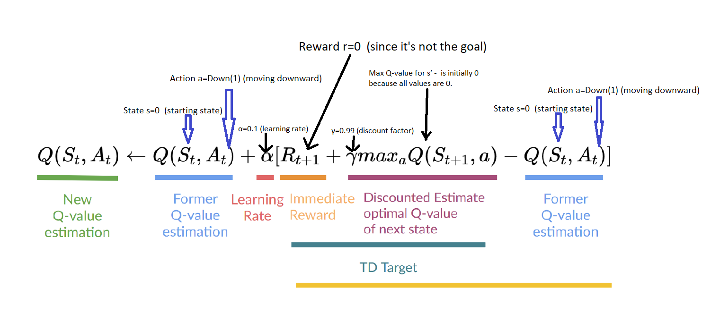

## **How does LLM work ? - Part 1** 

### **Reinforcement** **Learning**

Well, we will not directly jump into LLM , but build an intuition of Learning in general and then take it forward. Lets just walk through different learning process via simple examples and  understand some of the fundamentals and build the intuition about how simple LLMs work and finally a look at how  ChatGPT and Deepseek R1 works.

At the core, Machine learning is all about data.

 If we have labelled data (input-output pairs) to learn from, it's called **supervised learning** . e.g Teaching a child Apple and an Orange by showing them what it is.

if we don't have labels and need to discover hidden patterns  and structures of data it's **unsupervised** **learning**. A child sorting their toys into groups based on shape or color without being told how.

if we learn by taking actions in an environment, receiving rewards or penalties, and improving over time, it's **Reinforcement** **Learning**. A child learning to walk -  In reinforcement learning, the child (agent) interacts with the environment (trying to walk), receives feedback (falling is a penalty, succeeding is a reward), and learns through trial and error to improve (walking better over time)

The child is now a boy learnt to walk and now wants a gift. Lets help him get it.

Lets start with this simple game of Frozen Lake. All we need is to have this boy walk and collect the gift without falling into the hole. 

Watch here.

https://www.youtube.com/shorts/MWC4TfwbKAc

We got to find a path that can lead the boy to the gift box without falling into the hole. It doesn't take more than a second to figure out a path. Each one of us can figure out one of the few options to walk that can take us to the destination. Things are easy  for us as we get to the see the eagles eye view of the **Environment**.

Now, the same environment can get tricky if we are given an earth view as shown in the below image and assume you are  the boy wanting to reach the gift .  Assume that each door is closed and you can move in one of the four directions up, down, left or right .  

Also, if you open the door that has a hole beneath it, you fall into the hole. what we do is we keep trying different options  till we reach the gift .let's say each time note down the actions that took us to the destination and also the ones that made us fall into the hole. if we fall into the hole, we swim back to the start position and try again . What we would next time is try not to take the same action i.e open the door of a cell that made us fall into the hole and try to open a different door.

 If we keep repeating this process , we will at one point reach the destination collect the gift.  The notes that we would have taken, can be used by us or given to anyone who wanted to try this game .  So, the next time they play, they can reach the destination and collect the gift  using the right path without falling into the hole. The path we took may or may not be a optimal path.  

If we give our notes to someone, they have a choice to follow our path as is or can try to open a different door or actions to explore a bit to find a better path. If anyone repeatedly follow the same path to collect the gift without taking a risk is called **Exploitation** . if some one is willing to take a bit of risk in a bid to find an alternative path which may or may not be optimal than the current one is called **Exploration** . Each time we  try to reach the destination, we may end up  in the destination or fall into the hole. Each of this cycle is called an **Episode**. Each cell is called as **State** and each episode end with a **terminal state** i.e either in a state (cell) where the gift is or a hole. We end in a terminal state and  then start the new episode.

Now, lets focus on the notes that we have taken and what does it have. Our goal is to reach the destination and collect the gift . Lets give each cell a number and call it as "**State**" . So, state 0 corresponds to the cell (0,0) and so on still state 15 which is the final state where the gift is present . From each state we can navigate to the next nearby cell by taking one of the actions, i.e moving up, moving right, moving down or moving left.

Now, lets assume we are in Stage 0, i.e cell 0,0 , we can take the following actions , either go right, or go down. Lets assume, we go down to state 4 and then from state 4 we take right and fall into the hole.. Oops, we now have learnt that this path will not help us.. or in other words this path didn't reward our actions. So, lets give some numbers as rewards,  e.g 0 in case the not reaching goal and 1 f we reach the goal, so the machine keeps learning,  episode after episode to firm up the learning.

 In this example, we don't explicitly set rewards and is built in in the open AI Gym environment of Frozen Lake.  In the subsequent examples , we will also explore other options with explicit rewards and also dynamic rewarding features.

So far we have discussed about States (Cells), Actions (Left, right, up, down), rewards, exploration and exploitation. Lets now firm up this way of learning into a table and call it  Q-Table (refer table below)

The idea is from each state, what is the best action to take to reach the goal. the best action should have highest value in the row  of the Q- Table. Example if we are in state 0 or Cell (0,0) and the highest value in the corresponding row is say  in Down, then we take action down from State 0

Example

Now lets Initialize the table with Zero values and start learning.

| **State** | **Left (0)** | **Down (1)** | **Right (2)** | **Up (3)** |
| --------- | ------------ | ------------ | ------------- | ---------- |
| **0**     | 0            | 0            | 0             | 0          |
| **1**     | 0            | 0            | 0             | 0          |
| **2**     | 0            | 0            | 0             | 0          |
| **3**     | 0            | 0            | 0             | 0          |
| **4**     | 0            | 0            | 0             | 0          |
| **5**     | 0            | 0            | 0             | 0          |
| **6**     | 0            | 0            | 0             | 0          |
| **7**     | 0            | 0            | 0             | 0          |
| **8**     | 0            | 0            | 0             | 0          |
| **9**     | 0            | 0            | 0             | 0          |
| **10**    | 0            | 0            | 0             | 0          |
| **11**    | 0            | 0            | 0             | 0          |
| **12**    | 0            | 0            | 0             | 0          |
| **13**    | 0            | 0            | 0             | 0          |
| **14**    | 0            | 0            | 0             | 0          |
| **15**    | 0            | 0            | 0             | 0          |

Ah, how we learn ?? :)

Lets try.. lets define some variables 

- ( s ) = Current state - the cell we are in at the moment 
- ( a ) = Chosen action - The direction we decide to move left, right, up  or down
- ( r ) = Received reward - If we reach the goal we get reward of 1 , else 0
- ( s' ) = New state -  the cell we reached after taking the action.

in the example above, we moved from State 0 to Stage 1 by taking action down.  Since we initialize the table with Q values of 0, our initial movements will be completely random and as long we don't fall into the hole, we keep moving one step at time and update table.. How do we update? 

### Q-learning Update Rule

For each action, the Q-value is updated leveraging the Bellman equation: 

Our objective is to update the Q- Table with new Q values with our learning and we will use this formula.

**New Q = Old Q + α × [Reward + γ × Max Future Q - Old Q]**

where 

*New Q: The updated Q-value for the state-action pair.*

*Old Q: The current Q-value before the update (Q(s, a)).*

*α: Learning rate (e.g., 0.1), controlling how much the new information influences the old value.*

*Reward: Immediate reward (r) received after taking action a in state s.*

*γ: Discount factor (e.g., 0.9), weighing the importance of future rewards.*

*Max Future Q: The maximum Q-value over all possible actions in the next state (s'), i.e., max⁡aQ(s′,a)\max_a Q(s', a)maxaQ(s′,a).*

​	

More formal way of arriving at this formula is shown below:

​						New Q = Old Q + α × [Reward + γ × Max Future Q - Old Q]

$$
Q(s, a) \leftarrow Q(s, a) + \alpha \left( r + \gamma \max_a Q(s', a) - Q(s, a) \right)
$$

Let's take an example where all Q-values are initially **0** and update one Q-value using **Bellman’s equation** after the first step.

**Applying Bellman’s Equation**

------

### **Scenario**

- **State s=0 ** (starting state)
- **Action a=Down(1)** (moving downward)
- **Next State s′=4s' **
- **Reward r=0 ** (since it's not the goal)
- **Initial Q(0, Down) = 0**
- **α=0.1** (learning rate)
- **γ=0.99** (discount factor)
- **Max Q-value for s′=4s' is initially 0 because all values are 0.**

------

 **lets combine the Q -update formula with the initial state - 0** . We will just see mostly Zeors during the start of the learning and will gradually get better after repeating this process 1000's of episodes.

### **Example: Second Update After Finding a Better Path**

Now, suppose in a later episode, **State 4** learns that moving **Down (1) → State 8** has a better reward, and its Q-value updates.

$$
Q(4,Down)=0.5
$$

because it learned a better path in later episodes)

- The next update for **State 0, Down (1)** happens with this new information.

$$
Q(s, a) \leftarrow Q(s, a) + \alpha \left( r + \gamma \max_a Q(s', a) - Q(s, a) \right)
$$

**Example: Update with Future Value**

Assume:

$$
Q(4, \text{Down}) = 0.5
$$

Then update:

$$
Q(0, \text{Down}) = 0 + 0.1 \times \left[ 0 + (0.99 \times 0.5) - 0 \right]
$$

$$
Q(0, \text{Down}) = 0 + 0.1 \times 0.495
$$

$$
Q(0, \text{Down}) = 0.0495
$$

Now with repeating the process we get this Q table and the best actions for each state will take it from State 0 to Stage 15

### **Legend**

- 🟩 **Green** → Highest Q-value in the row
- 🟨 **Yellow** → States in one of the path to reach the destination and collect the gift  (0 → 4 → 8 → 9 → 13 → 14 → 15)

### **Q-Table with Highlights**

| **State** | **Left (0)**  | **Down (1)**  | **Right (2)** | **Up (3)** |
| --------- | ------------- | ------------- | ------------- | ---------- |
| **🟨 0**  | 0.9415        | **🟩 0.9510** | 0.9321        | 0.9415     |
| **1**     | **🟩 0.9415** | 0.0000        | 0.6025        | 0.7556     |
| **2**     | 0.1894        | **🟩 0.8126** | 0.0308        | 0.2218     |
| **3**     | **🟩 0.1430** | 0.0000        | 0.0007        | 0.0142     |
| **🟨 4**  | 0.9510        | **🟩 0.9606** | 0.0000        | 0.9415     |
| **5**     | 0.0000        | 0.0000        | 0.0000        | 0.0000     |
| **6**     | 0.0000        | **🟩 0.9541** | 0.0000        | 0.2707     |
| **7**     | 0.0000        | 0.0000        | 0.0000        | 0.0000     |
| **🟨 8**  | 0.9606        | 0.0000        | **🟩 0.9703** | 0.9510     |
| **🟨 9**  | 0.9606        | **🟩 0.9801** | **🟩 0.9801** | 0.0000     |
| **10**    | 0.9093        | **🟩 0.9900** | 0.0000        | 0.6927     |
| **11**    | 0.0000        | 0.0000        | 0.0000        | 0.0000     |
| **12**    | 0.0000        | 0.0000        | 0.0000        | 0.0000     |
| **🟨 13** | 0.0000        | 0.9801        | **🟩 0.9900** | 0.9703     |
| **🟨 14** | 0.9801        | 0.9900        | **🟩 1.0000** | 0.9801     |
| **🟨 15** | 0.0000        | 0.0000        | 0.0000        | 0.0000     |

We will just use a learning method known as Q Learning method of reinforcement learning . No Models, No fancy algorithm. just a math formula which we can do it with pen and paper if we have patience . but we have a computer , so we just run it.

you can do it your self from here - https://colab.research.google.com/drive/1-DXoIrfS3OixbRFvCF3IFZS72RL2E6pY?authuser=1#scrollTo=-S9OL7aat0gz

Q_Table_Forzen_Lake

So, with just a simple table we have learnt how to play the game. Navigate and collect the gift. However, this works when the environment is finite and so does the actions. Nevertheless we have done a 101 of reinforcement learning :) .. the diagram below is the typical representation of the process. The agent is the boy, the environment is the the frozen lake , the state is the cell the actions are the direction of movement  and the reward is what we get from each cell till we reach the gift.

 

GitHub code:

