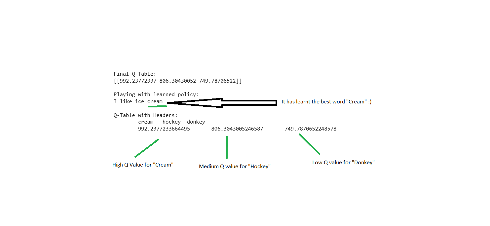

### **How does LLM work ? - Part 2**

##### Word Prediction using Q Learning and Deep Q Learning

Lets extend the game to play with words

Now that we have an idea of how to make a machine  play a Frozen lake game from the previous article, the idea can be extended to any game that is not complex and has finite states and actions .

We will now Train an agent using **Q-learning** to optimize a sentence completion task for the sentence

 **i like ice ** _______________________  `"cream" ?`, `"hockey"`?, or `"donkey"` ?


1. **Environment Setup**:

   *  Our Environment is now much simpler than a frozen lake example . Here we just have a sentence "I like ice " in one cell, and we cake take three possible directions to complete it.

     This is just to get the intuition of how we can relate our sentence completion problem with the frozen lake example 

     | Cream        |            |
     | ------------ | ---------- |
     | I like ice ? | **Hockey** |
     | **Donkey**   |            |

   - Completions**: I like ice __ ? Possible outcomes (`"cream"`, `"hockey"`, `"donkey"`).

   - Rewards - In frozen lake example ,we had "0" rewards on all cells and a reward of "1" for Gift. Here we will have three different rewards as below. Btw, a reward is noting but points we can collect if we reach that cell .

     : Positive and negative feedback:

     - `"cream"`: +10
     - `"hockey"`: +5
     - `"donkey"`: -10


We initialize a Q - Table with just zeros and start learning and update this Q Table.

| State (0)  | Cream (Action 0) | Hockey (Action 1) | Donkey (Action 2) |
| ---------- | ---------------- | ----------------- | ----------------- |
| I_like_ice | 0                | 0                 | 0                 |

The example above is all about just one state i.e stage 0 and it represents (i_like_ice) and it can take any of the three actions 0 → represents  "cream", 1 represents → "hockey", 2  represents → "donkey" . 

Also each action gives us a return and the corresponding reward from completion_rewards (e.g., 10 for "cream", 5 for "hockey", -10 for "donkey").

So, the if we keep asking the question again and again  I_like_ice ? and randomly pick a completion word from one of the three and keep getting rewards or penalty, we at one fine point will learn what is the best choice .. i'ts like this 


​	1) I_like_ice ? Hockey (Action 1), get a reward +5 , update the q table

​	2) I_like_ice ? Donkey (Action 2), get a penalty -10 , update the q table

​	3) I_like_ice ? Cream (Action 0), get a reward +10 , update the q table

​	4) I_like_ice ? Cream (Action 0), get a reward +10 , update the q table

​	5)I_like_ice ? Hockey (Action 1), get a reward +5 , update the q table

​	...... keep doing N number of times 


  Q table update formula

`q_table[state, action] += alpha * (reward + gamma * np.max(q_table[state]) - q_table[state, action])`

- - Breakdown
    -  reward: Immediate reward from the action ( +5,  -10, +10)
    -  gamma * np.max(q_table[state]): Discounted maximum future reward (here, 0 initially since all Q-values start at 0, but it updates over time).
    -  q_table[state, action]: Current Q-value for the state-action pair.
    -  alpha * (...): Learning rate scales the adjustment.
  - This updates the Q-value toward the expected future reward, balancing immediate and future gains.
- done = True: Ends the episode after one action (a simplification).

**Epsilon Decay**: epsilon = max(epsilon_min, epsilon * epsilon_decay) reduces exploration over time, but never below 0.01.

After repeating the above Training in a loop, we end up with the Q table as shown below. it just says, if  the state is 0 (i.e i_like_ice), the next  best word for completion is "Cream" since it has got the maximum Q value as shown below in the row.

Playing with learned policy 10 times:

### **

```
def play_sentence_completion():

    print("\nPlaying with learned policy:")

    state = 0

    for _ in range(10):

        action = np.random.choice(np.flatnonzero(q_table[state] == q_table[state].max()))

        print(f"I like ice {completions[action]}")

play_sentence_completion()`

```


Will give you the following output all the time,  Since we are picking the word with maximum Q value and it's always "Cream"

I like ice cream
I like ice cream
I like ice cream
I like ice cream
I like ice cream
I like ice cream
I like ice cream
I like ice cream
I like ice cream
I like ice cream


Now, lets see what happens if we convert the Q Table scores into Probabilities 


Q value:

[[992.12783859 768.96445522 822.78152888]]

This corresponds to Q-values for the state=0 and actions mapping to ["cream","hockey","donkey"]["cream", "hockey", "donkey"] ["cream","hockey","donkey"].

Let's calculate the **softmax probabilities** and **smoothed probabilities with temperature = 100**.

Softmax is just a function which can help to covert scores into probabilities so that they sum up to 1


$$ P(action_i) = \frac{e^{Q(state, action_i)}}{\sum_{j} e^{Q(state, action_j)}} $$

For numerical stability, we subtract the maximum Q-value before exponentiation.

### Q-Values

- \( Q[0] = 992.12783859 \) (action 0: "cream")
- \( Q[1] = 768.96445522 \) (action 1: "hockey")
- \( Q[2] = 822.78152888 \) (action 2: "donkey")

### Maximum Q-Value

- $ \max(Q) = 992.12783859 $

### Centered Q-Values

- $ Q[0] - \max(Q) = 992.12783859 - 992.12783859 = 0 $
- $Q[1] - \max(Q) = 768.96445522 - 992.12783859 = -223.16338337 $
- $Q[2] - \max(Q) = 822.78152888 - 992.12783859 = -169.34630971$

### Exponential of Centered Q-Values

- $ e^0 = 1 $
- $ e^{-223.16338337} \approx 1.37 \times 10^{-97} $ (extremely  small)
- $e^{-169.34630971} \approx 5.64 \times 10^{-74} $  (also extremely small)

### Sum of Exponentials

- $\sum e^{Q - \max(Q)} \approx 1 + 1.37 \times 10^{-97} + 5.64 \times 10^{-74} $
- Since the second and third terms are negligible compared to 1, the sum is approximately 1.

### Probabilities

- $ P(action_0) = \frac{e^0}{1} \approx 1 $
- $ P(action_1) = \frac{e^{-223.16338337}}{1} \approx 1.37 \times 10^{-97} $
- $P(action_2) = \frac{e^{-169.34630971}}{1} \approx 5.64 \times 10^{-74} $

### Result

The softmax probabilities are approximately:

- $ P(\text{cream}) \approx 1.0 $
- $P(\text{hockey}) \approx 0.0 $
- $P(\text{donkey}) \approx 0.0 $


##### This reflects the dominance of "cream" due to its much higher Q-value.


if you look at the above, the Probability of cream is 1  and others are 0, which means every time the word Cream is going to be predicted and others have no chance even though the original Q values [[992.12783859 768.96445522 822.78152888]] gave some opportunity for Hockey and Donkey. 

The SoftMax has set the mass of all probability to "Cream" . This happens because, smaller differences in values are boosted exponentially by SoftMax.  i.e even though the numbers 992.12783859 768.96445522 822.78152888 appear to be close, the SoftMax has boosted 992.12783859 (i.e cream)

In order to give Hockey and Donkey a chance to be predicted once in a while, we have to adjust the formula for SoftMax with what we call it "temperature" .  Just a division by any constant that we can choose .

## Smoothed Probabilities with Temperature

The temperature-adjusted softmax formula is:

$$ P(action_i) = \frac{e^{(Q(state, action_i) - \max(Q)) / temperature}}{\sum_{j} e^{(Q(state, action_j) - \max(Q)) / temperature}} $$

With \( temperature = 100 \).

### Centered Q-Values Divided by Temperature

- $ \frac{Q[0] - \max(Q)}{100} = \frac{0}{100} = 0 $
- $ \frac{Q[1] - \max(Q)}{100} = \frac{-223.16338337}{100} = -2.2316338337 $
- $ \frac{Q[2] - \max(Q)}{100} = \frac{-169.34630971}{100} = -1.6934630971 $

### Exponential of Adjusted Values

- $e^0 = 1 $
- $e^{-2.2316338337} \approx 0.1075 $
- $e^{-1.6934630971} \approx 0.1841$

### Sum of Exponentials

- $ \sum = 1 + 0.1075 + 0.1841 \approx 1.2916 $

### Probabilities

- $P(action_0) = \frac{1}{1.2916} \approx 0.7743 $
- $P(action_1) = \frac{0.1075}{1.2916} \approx 0.0832 $
- $P(action_2) = \frac{0.1841}{1.2916} \approx 0.1425 $

### Result

The smoothed probabilities with \( temperature = 100 \) are approximately:

- $P(\text{cream}) \approx 0.7743 $
- $ P(\text{hockey}) \approx 0.0832 $
- $P(\text{donkey}) \approx 0.1425 $

## Summary of Results

- **Softmax Probabilities (without temperature):**
  - $P(\text{cream}) \approx 1.0 $
  - $ P(\text{hockey}) \approx 0.0 $
  - $P(\text{donkey}) \approx 0.0 $
- **Smoothed Probabilities (with temperature = 100):**
  - $P(\text{cream}) \approx 0.7743 $
  - $P(\text{hockey}) \approx 0.0832 $
  - $P(\text{donkey}) \approx 0.1425 $

## Interpretation

- The raw softmax heavily favors "cream" due to its significantly higher Q-value.
- The high temperature (100) flattens the distribution, allowing "hockey" and "donkey" to have non-negligible probabilities, encouraging exploration.


Now  , if we try to play the word prediction game , we get different outputs with the probabilities of Cream (77%), Hockey (8%) and Donkey (14%)

Initialize Q-Table:
​	cream	hockey	donkey
​	0.0	0.0	0.0

Learned Q- Table:
​	cream	hockey	donkey
​	992.127838590694	768.9644552201327	822.7815288796706


Probabilities: [1.00000000e+00 1.20607423e-97 2.84336204e-74]

Smoothed Probabilities: [0.77445266 0.08313973 0.14240761]

**Playing with learned policy:**

I like ice donkey
I like ice cream
I like ice donkey
I like ice cream
I like ice cream
I like ice cream
I like ice cream
I like ice cream
I like ice donkey
I like ice donkey


if you notice the above q value,probabilities , you will notice that Hockey (reward +5) isn't being predicted while donkey  despite having more penalty (-10) has got predicted few times .That's how the learning has happened and random sample from probability distributions work. If we try to learn one more time and play the game again, we get different distribution and  the output this time along with Cream, Hockey  gets a chance.


Initialize Q-Table:
​	cream	hockey	donkey
​	0.0	0.0	0.0


Learned Q-Table :
​	cream	hockey	donkey
​	992.1286183247347	769.6658906773366	783.0579169752848


Probabilities: [1.00000000e+00 2.43032835e-97 1.59128539e-91]


Smoothed Probabilities: [0.81188112 0.0877706  0.10034828]


**Playing with learned policy:**

I like ice cream
I like ice cream
I like ice cream
I like ice cream
I like ice cream
I like ice cream
I like ice cream
I like ice cream
I like ice hockey
I like ice cream


**NOTE**: Please note that we have not yet used any word representations or embeddings yet. Please remember that the simple example above just encodes  I_like_ice as State 0  while the numbers 0, 1, 2 encodes cream, hockey and Donkey. So, this small word has just four words in it's world of vocabulary.

 I_like_ice (1) together is treated as one word, and cream (2), hockey(3) and Donkey (4) are the three other words.  what is means is that there this example doesn't demonstrate any NLP capabilities yet, but to get an intuition on how we can co-relate RL Grid example with  word completions. We will get into details of word embeddings in the upcoming part that is used by LLMs


Some terminology :


**Policy** : A policy in reinforcement learning is the agent’s strategy for selecting actions based on states, learned or designed to maximize rewards. It can be deterministic ( like using static q table with max value) or stochastic ( like using probabilistic q table) , and its optimization is the core of RL. The decision making process by which the algorithm takes actions , i.e predicting the word by using the  the Max of Q values OR Probability Distribution of Q values is known a policy.

Agent

- The decision-making entity (e.g., a robot, Word predictor, or you learning to serve like Federer) that interacts with the environment to achieve a goal.

Environment

- The external system or world with which the agent interacts (e.g., a tennis court, a game, or a simulated grid). It provides states and rewards based on the agent’s actions.

State (S)

- A representation of the environment at a given time, capturing all relevant information for decision-making (e.g., your stance and ball position in the tennis, current word).

Action (A)

- A choice or move the agent can make (e.g., stepping left, tossing the ball higher , ). The set of possible actions (like words) is called the action space.

Reward (R)

- A scalar feedback signal from the environment indicating the immediate benefit or cost of an action (e.g., +10 for Cream, -10 for Donkey).

Policy (π)

- The strategy that maps states to actions, defining the agent’s behavior. It can be deterministic.

   (π(s)=a \pi(s) = a π(s)=a) or stochastic (π(a∣s)=P(a∣s) \pi(a|s) = P(a|s) π(a∣s)=P(a∣s)).

- Example: In Q-learning, the policy might be to pick the action with the highest Q-value.

Return (Gt)

- The cumulative reward over time, often discounted: $Gt=∑k=0∞γkrt+k,$
- where γ \gamma γ is the discount factor. It represents the long-term goal.

Discount Factor $(γ )$

- A value between 0 and 1 that weights future rewards. γ  close to 1 values long-term rewards highly; γ  close to 0 prioritizes immediate rewards (e.g., 0.99 in the Q-learning code).


#### Deep Q Network (DQN)

Now, we can replace the Q table with a neural network and can make it **Deep Q network.**

**A neural network with three fully connected layers is trained . The input to the network is a single scalar value representing the state, which is fixed at state = 0 throughout the code. This corresponds to the single state "I like ice ____" in the environment.

- Input: State representation (`1` in this case).
- Output: Q-values for each action.


#### **What is the Network?**

- **Class Definition**: The DQN class inherits from nn.Module and defines a feedforward neural network to approximate the Q-function Q(s,a) 

- Architecture

  :

  - **Input Layer**: nn.Linear(1, 64) – Takes the 1D input (state) and maps it to 64 hidden units.
  - **Hidden Layer 1**: nn.Linear(64, 64) with nn.ReLU() activation – Processes the 64 units, adding non-linearity.
  - **Hidden Layer 2**: nn.Linear(64, 64) with nn.ReLU() – Another 64-unit layer for deeper representation.
  - **Output Layer**: nn.Linear(64, output_dim) – Outputs Q-values for each action, where output_dim = len(completions) = 3 (one Q-value per action: "cream", "hockey", "donkey").

- **Forward Pass**: The forward method passes the input through the sequential layers (self.fc) to produce a tensor of Q-values.

- **Device**: The model is moved to device (CPU or GPU) using .to(device) for efficient computation.

#### **Parameters**

- **input_dim = 1**: Matches the single-state input.
- **output_dim = 3**: Corresponds to the number of actions (length of completions).
- **Activation**: ReLU introduces non-linearity, enabling the network to learn complex patterns (though with one state, its role is limited here).

#### **Training Components**

- **Optimizer**: optim.Adam with lr = alpha = 0.001 adjusts the network weights using gradient descent.
- **Loss Function**: nn.MSELoss() computes the mean squared error between predicted and target Q-values, driving the learning process.

#### **How It Learns**

- The network is trained using a variant of the Q-learning update, adapted for neural networks:
  - **Current Q-values**: Predicted by the network for the current state.
  - **Target Q-values**: Computed as  $r+γmax⁡aQ(s′,a)$,  where s′  is the next state (here, the same state since it’s single-step).
  - The loss is backpropagated to minimize the difference, updating weights via optimizer.step().

------

### **Output**

#### **What is the Output?**

- During Training

  The network outputs a tensor of Q-values for the three actions at each episode, updated via the loss function.

  - Example: After training, final_q_values might be [9.8, 4.9, -9.8], approximating the

     rewards [10, 5, -10] discounted over time.

- During Testing

  : The output is used in two ways:

  1. **Raw Q-Values**: Printed as final_q_values after the last episode.
  2. **Probabilities**: Converted to action probabilities using softmax (with and without temperature) for the play_sentence_completion function.

#### **Final Q-Values**

- After 8000 episodes, the network’s output for 

  state = 0

   is detached from the computation graph (

  .detach().cpu().numpy()

  ) and printed:

  ​

  `input_tensor = torch.FloatTensor([0]).to(device)final_q_values = model(input_tensor).detach().cpu().numpy()print(final_q_values)`

  ​

  - Example output: [9.8 4.9 -9.8] (approximate, depending on training).

#### **Probabilities in Play Phase**

- Softmax Probabilities

   Applied to final_q_values

  - Example: For [9.8, 4.9, -9.8], probabilities might be [0.999, 0.001, 0.000], heavily favoring the highest Q-value.

- Smoothed Probabilities

  :Adjusted with temperature = 500

  - Example: Might yield [0.6, 0.3, 0.1], flattening the distribution due to the high temperature.

- Actions**: 10 random choices are made using each probability set, printing sentences like "I like ice cream".


Final Q-Values: Deep Q Learning
[1000.00226  943.3921   862.4612 ]

Playing with learned policy:

Probabilities: [1.0000000e+00 2.5972649e-25 0.0000000e+00]
Learned Probabilities: [1.0000000e+00 2.5972649e-25 0.0000000e+00]
I like ice cream
I like ice cream
I like ice cream
I like ice cream
I like ice cream
I like ice cream
I like ice cream
I like ice cream
I like ice cream
I like ice cream

Altered Probabilities: [0.377008   0.33665073 0.28634125] will give robust outputs 

I like ice donkey
I like ice donkey
I like ice donkey
I like ice donkey
I like ice cream
I like ice cream
I like ice cream
I like ice donkey
I like ice donkey
I like ice hockey


https://colab.research.google.com/drive/1-DXoIrfS3OixbRFvCF3IFZS72RL2E6pY?authuser=1#scrollTo=-S9OL7aat0gz


The above is the location of the code and you can try it yourself .


