### *How does LLM work ? - Part 3 -  **

### **Word Representations**

In Part 1 we learnt about Reinforcement Learning , Part 2 we learnt about how a game problem can be related to word completion problem and introduced Deep Q Learning .

So far, we haven't used any NLP technique to "*understand*" the text . How do we make a machine understand text?

Word representations in **Natural Language Processing (NLP)** refer to how words are encoded into a machine-readable format. Different methods capture varying levels of meaning, structure, and context. 

Lets assume we have only the following words in a vocabulary { i, like, love, ice, cream}. We can make two sentences 

1. **"I like ice cream"**
2. **"I love ice cream"**


the easiest way to start with is assigning numbers to each word,  { i, like, love, ice, cream} ->  { 0, 1, 2, 3, 4}


So, "I like ice cream" can be represented as -> 0 1 3 4

​       "I love ice cream" can be represented as -> 0 2 3 4


if we ask the question - 0 1 3  __ ? , the answer is 4 

Though this is the simplest form,  English language is estimated to have around 171,476 words in current use and it would be inefficient to assign a number for each word and still don't learn anything about that word. 

Example word *like, love* has numbers *1, 2* and doesn't tell anything about it the relationship. If we ask the question is 1 and 2 similar ?, the machine will have no clue while as human we know like and love share some similarity in the context.

A better option is to represent it as vectors . lets explore different vector representations 

**A. One-Hot Encoding**


Each word is represented by a **binary vector** where only one position is `1`.

✅ **Pros**: Simple and easy to implement.
❌ **Cons**: No understanding of meaning or context.

| Word      | Vector          |
| --------- | --------------- |
| **I**     | [1, 0, 0, 0, 0] |
| **like**  | [0, 1, 0, 0, 0] |
| **love**  | [0, 0, 1, 0, 0] |
| **ice**   | [0, 0, 0, 1, 0] |
| **cream** | [0, 0, 0, 0, 1] |

------

### 

Lets just  bring down our vocabulary to just two words ***love***   & **like**  so our dimensions can be just 2 and easy to visualize .So, lets assign a vector for Love = (0,1), Like = (1,0)

| Word     | Vector |
| -------- | ------ |
| **like** | [0, 1] |
| **love** | [1,0]  |

------


If we plot the same in the X, Y Axis , we we see as shown below . 

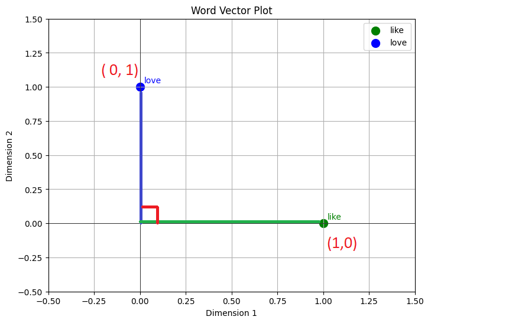

What we notice above is , the words are represented far away from each other though they have similar meaning . This is a problem with vectors or rather one hot encoding vector.

If we now consider the full vocabulary of the the total 5 words -  i ,like, love, ice, cream, it can be represented as 5 dimensional vector as shown below . If we have 6 words, it will be a 6-Dimension vector, if we have 7 words it will be 7-D vector , if we have 100 words in corpus it will be 100-D vector .. so naturally there is a challenge with these sparse vectors . If we have a document with 50K words, each words will have to be represented as 50K Dimension vector. 

Example : Like will have vector [ 0, 1, 0, 0 ,0 ....0, 0, 0............................................................50K]

In addition, each word will be independent with no relationship with each other  i.e 90 degree angle (refer pic above) . This means if we take Cosine (90) between like (1,0) and love (0,1), the answer will be 0 as  Cos(90)=0 . We take Cosine angle because if we Project the word (love) onto the X axis .  Suppose we project  (Like) into x axis, the projection will be at the point (0,0) , hence Cos (90)=0 . The below diagram shows the projection of the words "love" onto "like" and it will be Zero.


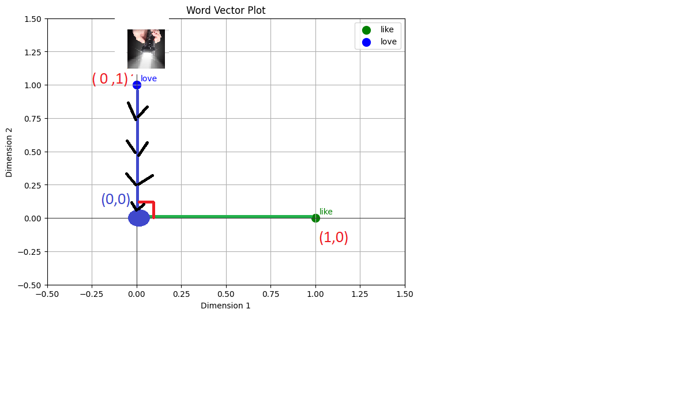

Our desire is to get some vector representation something like this i.e if we do ***something***, can we get two vectors for the words *love* and *like* that can be close to each other ?

Example  Love -> (0.89, 0.32)

​		  Like -> ( 0.91, 0.45 )

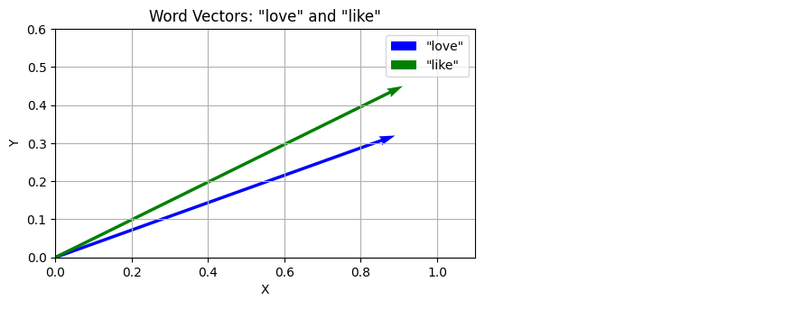


Lets start with what we know i.e lets assign one hot vector for these words

Love = (0,1), Like = (1,0) 

We now have to move away from this sparse vector representations ( 1's and most of them 0's)  to move denser representation  like (0.89, 0.32) which can bring the words with similar meanings and context closer.

This dense representations i.e word vectors like (0.89, 0.32) is known as Word Embedding. 

Over time, a wide range of NLP techniques have emerged. Early methods like **Bag of Words** focused on counting word frequencies, ignoring the order in which words appear. Techniques such as the **Co-Occurrence Matrix** advanced this by capturing how often words appear near each other. Building on these foundations, more sophisticated approaches like **Pointwise Mutual Information (PMI)** and **Singular Value Decomposition (SVD)** were developed to extract richer and more meaningful word representations from these frequency-based structures.


Example : Word *cream* will have a vector [0.0135  0.1915  0.1915  0.4090  0.0135] . This looks much better than having something like [0, 0, 0, 0, 1]

|           | I      | like   | love   | ice    | cream  |
| --------- | ------ | ------ | ------ | ------ | ------ |
| **I**     | 0.0135 | 0.1915 | 0.1915 | 0.4090 | 0.0135 |
| **like**  | 0.1915 | 0.0215 | 0.0215 | 0.0342 | 0.1915 |
| **love**  | 0.1915 | 0.0215 | 0.0215 | 0.0342 | 0.1915 |
| **ice**   | 0.4090 | 0.0342 | 0.0342 | 0.0340 | 0.4090 |
| **cream** | 0.0135 | 0.1915 | 0.1915 | 0.4090 | 0.0135 |


Note: Have given references  to different techniques for Word Representations in the Appendix below. We will now focus of two path breaking techniques - word2vec (2013) and Transformers - Attention (2017) which formed the basis of modern NLP leading to BERT, ChatGPT, DeepseekR1, GROG .All these fundamentally depend on the concepts of Transformers, which depends on Sophisticated Attention mechanisms which significantly enhanced word vector representations paying way for Large Language Models (LLMs) 

We will focus on explaining the significance of word2vec and attentions with the following toy example. The fundamentals can be taken to scale. While traditionally most word vector representations used statistical techniques , word2vec used Neural network - deep learning and gave significantly better word vectors.

#### word2vec:

Though we have been using vectors to represent words all along the discussion so far, word2vec just means the neural network based word vector embedding. The fundamental idea is use the text  as labels and convert it into a supervised learning problem . i.e if we have a sentence " i like ice cream" ,  we can convert them  into input -output pairs of labels, if we given input **"i"**,  predict **"like"** . The table below shows how a simple sequence of text can be converted into input-output pairs i.e labels that the machine can learn from.

Word2Vec is a neural network-based technique that learns word embeddings by predicting linguistic contexts. It has two main variants:

- **CBOW**: Predicts a target word (input context) from surrounding words (output).
- **Skip-Gram**: Predicts surrounding words (output context) from a target word (input).

The embeddings are learned in the hidden layer, and their interpretation differs based on the model.


if input is "ice", predict "cream". 

| Input | Label |
| ----- | ----- |
| I     | like  |
| ice   | cream |
| like  | ice   |

Here is how it works. Lets simulate an example We will use Skip-Gram:  i.e given an input *ice* , it should predict *cream*  from one on the four possible options (i, like ,ice ,cream) and these are context words

If we give input as "ice" and want to get output "cream" and the hidden layer that has been learnt is the word embedding for the word "ice" . We have 2 nodes (in green below) so the embedding dimension is 2 for the word vector [0.50,0.80] . we can choose any dimension . Example BERT uses 768 Dimension , ChatGPT, Deepseek might use with thousands, just imagine the green hidden layer below can be 1000s of nodes long .


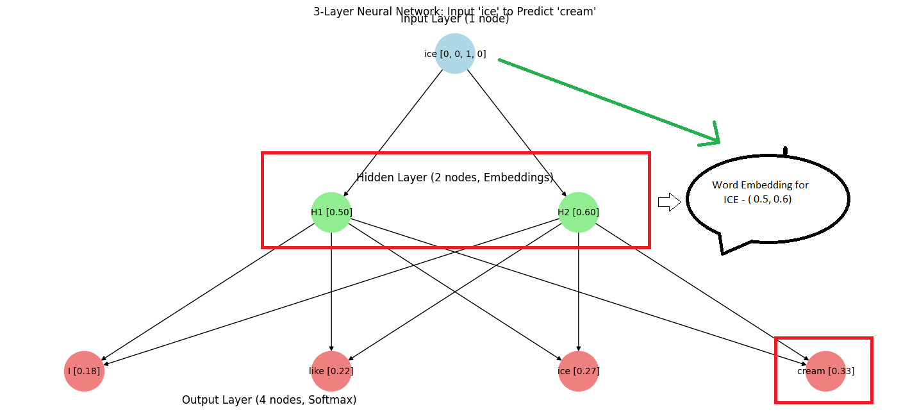


Lets analyze the above diagram :

Input Vector (ice): [0 0 1 0]

Hidden Weights (as Embeddings):
[[0.1 0.2]
 [0.3 0.4]
 **[0.5 0.6]**
 [0.7 0.8]]

Hidden Output (Embedding for ice): [0.5 0.6]

Output Before Softmax: [0.45 0.66 0.87 1.08]

Softmax Output: [0.17751741 0.21899934 0.27017468 **0.33330857**]

Predicted Class: **cream**


Another Example:

------------------------

If we give input as "i" and want to get output "like"


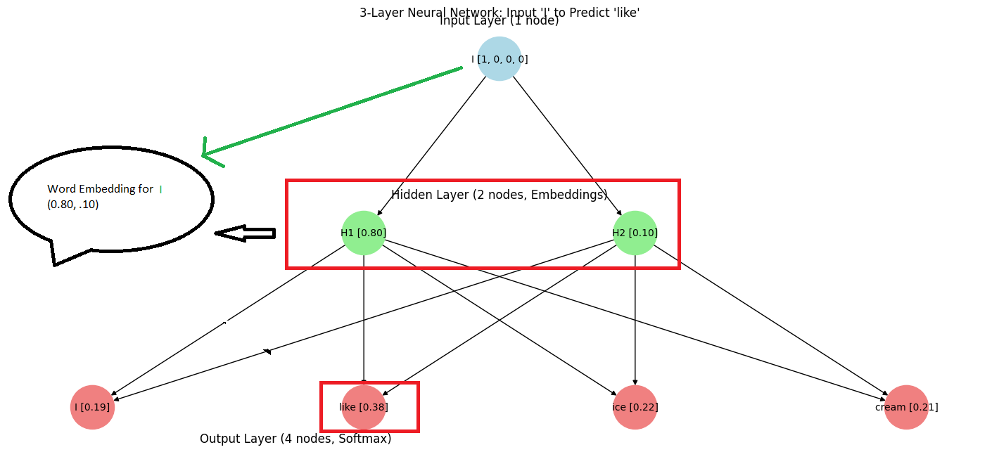


Input Vector (I): [1 0 0 0]

Hidden Weights (as Embeddings):
**[[0.8 0.1]**
 [0.2 0.9]
 [0.3 0.4]
 [0.5 0.6]]

Hidden Output (Embedding for I): [0.8 0.1]

Output Before Softmax: [0.22 0.94 0.37 0.36]

Softmax Output: [0.18633976 **0.38282259** 0.21649591 0.21434174]


Predicted Class: like


Lets visualize word2vec after the embeddings are learnt. 


**The code for word2vec is here and you try it yourself.**


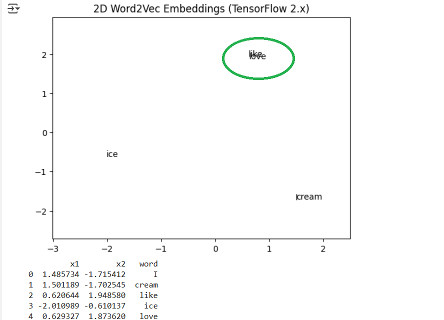

### 

------------------------


If you look the plot , the words *like* and *love* got close to each other because the vectors had similar embeddings .

is there a way to bring ice and cream closer ? may be lets try by increasing the context window form 2 to 4 .i.e look for four word pairs  like  -  (i , like) ( i, ice) ( i, cream) 

Blue dots are learnt with context window size 2 while green dots are with context window size 4. 

If you notice in the plot below , the blue dots has ice and cream a bit far while green dots has got them closer with context window size of 4. This also a includes a simple attention mechanism on top of word2vec. However, since the word2vec vectors were already close (green ones), the attention didn't have much impact in this toy example. What you notice is that given the context, all these words  are pretty close to each other . i.e if we have a word vector for "ice",  word vector for "cream" is close by,  love and like is close by. We have learnt the semantic similarities of words


| PAIR         | Original  Similarity | After Attention Sim | Δ       |
| ------------ | -------------------- | ------------------- | ------- |
| love - like  | 1.0000               | 1.0000              | +0.0000 |
| ice - cream  | 1.0000               | 1.0000              | +0.0000 |
| I - love     | 1.0000               | 1.0000              | +0.0000 |
| I - like     | 1.0000               | 1.0000              | +0.0000 |
| love - cream | 1.0000               | 1.0000              | +0.0000 |


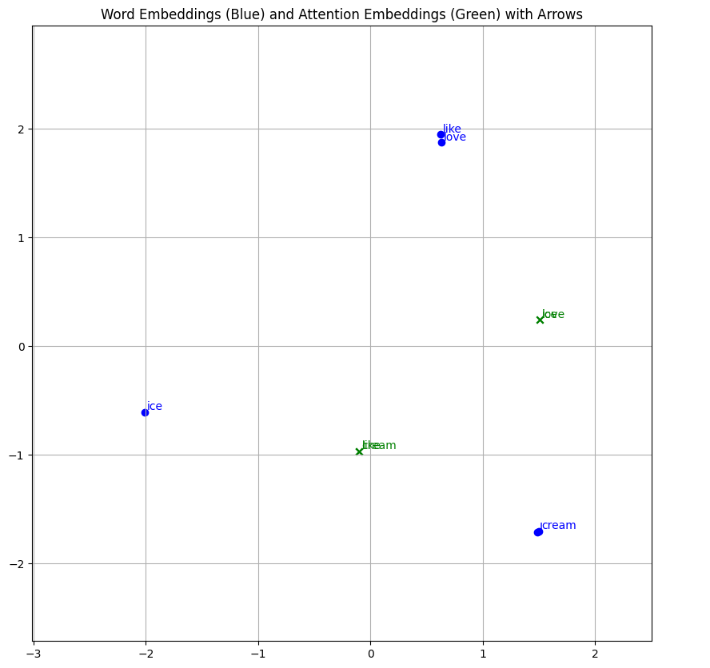


### Lets now understand how Self-Attention Works:


I have introduced the word (attention /self-attention) in above section, without explaining why it's needed. Why attention and how is it enhances word embeddings (word2vec) ?

Example:  I had ice cream near the river bank and then went to deposit money in the bank.

Notice that word bank has two meanings depending on the words near by, river bank vs financial bank

word2vec is Static: A word’s vector is fixed after training, regardless of the sentence (e.g., "bank" always has one vector, whether financial or river).

Attention makes it Dynamic: A word’s representation changes based on the sentence (e.g., "bank" adjusts meaning depending on "river" or "money" nearby).

Below is the comparison and we will see Attention mechanism in detail later

| **Aspect**            | **Word2Vec**                             | **Self-Attention**                       |
| --------------------- | ---------------------------------------- | ---------------------------------------- |
| **Definition**        | A static word embedding method that generates fixed vector representations for words based on their context in a large corpus. | A dynamic attention mechanism used in transformers, allowing a model to weigh the importance of different words in a sequence when processing each word. |
| **Core Idea**         | Words appearing in similar contexts are assigned similar vector representations, capturing semantic meaning. | Each word in a sequence attends to all other words, adjusting its representation based on their relevance, enabling context-aware processing. |
| **Architecture**      | Uses shallow neural networks (e.g., CBOW or Skip-gram) trained on word co-occurrences. | Part of the transformer architecture, relying on multiple attention heads and feed-forward layers to compute context dynamically. |
| **Context Handling**  | Static: A word’s vector is fixed after training, regardless of the sentence (e.g., "bank" always has one vector, whether financial or river). | Dynamic: A word’s representation changes based on the sentence (e.g., "bank" adjusts meaning depending on "river" or "money" nearby). |
| **Training Approach** | Pre-trained on a corpus, then used as a feature extractor; doesn’t adapt during inference. | Trained end-to-end with the model (e.g., in BERT or GPT), adapting to specific tasks during fine-tuning. |
| **Computation**       | Relatively lightweight, pre-computes embeddings offline. | Computationally intensive, performs attention calculations for every word pair in real-time. |
| **Use Case**          | Initial word embeddings for traditional NLP tasks (e.g., sentiment analysis with fixed features). | Core component of modern language models (LLMs) for tasks requiring deep context understanding, like translation or question answering. |
| **Example**           | Training on a corpus might map "king" and "queen" close together due to similar contexts. | In "The king ruled the land," "king" attends more to "ruled" and "land" than distant words, refining its meaning dynamically. |

**How Attention works ?**

1. **Token Embedding**:Each word in the sentence is converted into a fixed-size vector (here, 2D random vectors).

2. **Query (Q), Key (K), Value (V)**:In basic self-attention, Q, K, and V are usually projections of the word embeddings. In this example, we use the word embeddings directly for simplicity.

3. **Attention Scores**:We compute scores using the dot product between each pair of Q and K:

   $score(i,j)=Qi⋅KjT$

   ​

4. **Softmax Normalization**:Convert the scores into probabilities:

   $attention_weights i,j= \frac{e^{\text{score}_{i,j}}}{\sum_k e^{\text{score}_{i,k}}}$

   ​

5. **Attention Output**:Multiply these weights by the value vectors V and sum:

   $output=∑attention_weights_ij⋅Vj$

   ​


Reference Diagrams to start with. All we will do from now on is some multiplications and additions on word vectors and dense them to get better.

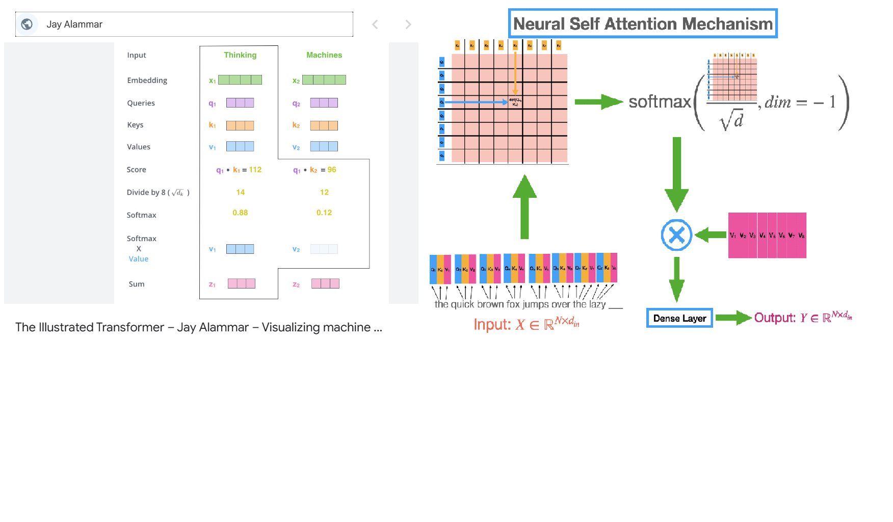

### Self Attention - Lets Explore with another Example.


Lets take a corpus :

Corpus = ['king is a strong man', 

​          'queen is a wise woman', 

​          'boy is a young man',

​          'girl is a young woman',

​          'prince is a young king',

​          'princess is a young queen',

​          'man is strong', 

​          'woman is pretty',

​          'prince is a boy will be king',

​          'princess is a girl will be queen']


We wanted to apply self attention and see how it works. we will use the following code to generate the word2vec and apply self attention using the excel below 

Code -  https://colab.research.google.com/drive/1A0OJxFWUPPxfXby57oHt7TEY1DHnDv8Y

Excel -

Step 1 - We take all the word2vec for all words in two dimensions (D1 and D2) . Easy to visualize.

Step 2- Lets take the Query, Key and Value to be the same as word embedding (Again to keep it simple while in real time,you can use different initialization of Q K V  matrices)

Step 3 - Multiply query and key for all word vectors . In our case since Q=K=V= Original word emending, we will just use it. Example for word Queen, the vector is 

| word  | D1       | D2       |
| ----- | -------- | -------- |
| queen | 8.40E-01 | 8.14E-01 |

so, we will multiply queen - Q * Q = 7.05E-01

| Queen  score |
| ------------ |
| 7.05E-01     |

Step 4: 

We can skip dividing by square root of d i.e Dimensions which is 2 . In original transformer from the paper they used 64 dimensions to represent word , so square root of 64 =8 was used in division.The use of the $ \sqrt{d} $  (where d  is the dimension of the key vectors), a scaled dot-product attention mechanism is a critical normalization step that stabilizes and improves the training of the model . Since our dimension is just two, we don't see a real need here.


Step 5:

We then normalize the scores using softmax . i.e all the scores sum to 1

| Queen  score |
| ------------ |
| 7.05E-01     |
| -9.95E-01    |
| 7.42E+00     |
| 9.55E-01     |
| 3.66E-02     |
| -7.82E-01    |
| 3.04E+00     |
| 4.88E+00     |
| -4.87E-01    |
| 4.11E+00     |
| -6.21E-01    |
| -3.39E+00    |

### **Step-by-Step Softmax Computation**

1. Compute Exponentials (exi e^{x_i} exi)

   :

   - $e^{0.705} \approx 2.024 $

   - $ e^{-0.995} \approx 0.370 $

   - $ e^{-0.995} \approx 0.370 $

   - $ e^{7.42} \approx 1681.845$

   - $e^{0.955} \approx 2.598$

   - $ e^{0.0366} \approx 1.037 $

   - $ e^{-0.782} \approx 0.457$

   - $e^{3.04} \approx 20.894 $

   - $ e^{4.88} \approx 131.858$

   - $e^{-0.487} \approx 0.614$

   - $e^{4.11} \approx 61.009 $

   - $e^{-0.621} \approx 0.537 $

   - $e^{-3.39} \approx 0.034$

     ​

2. **Sum of Exponentials**:  ≈1903.647

3. Compute Softmax Values for all rows 

   ​

   - $softmax(0.705)≈0.001063  = \frac{2.024}{1903.647} \approx 0.001063 $

     ...

     \..

   - And we finally get the results below an have explained the same

   - ​

   - ​

Step  6:  Multiply the score with value vector 


Step 7: We get the final self attention vector .

Below is the take away of Self Attention

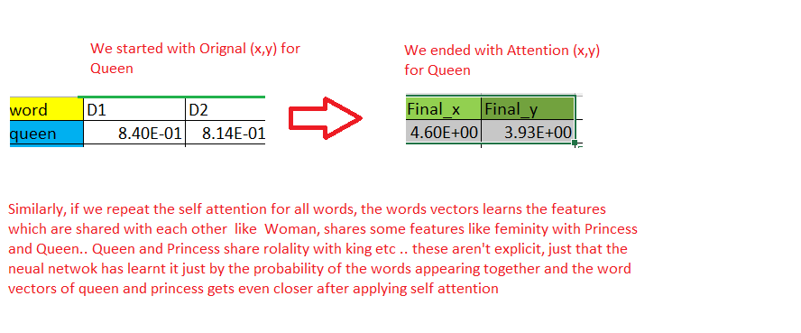

Results of Self Attention

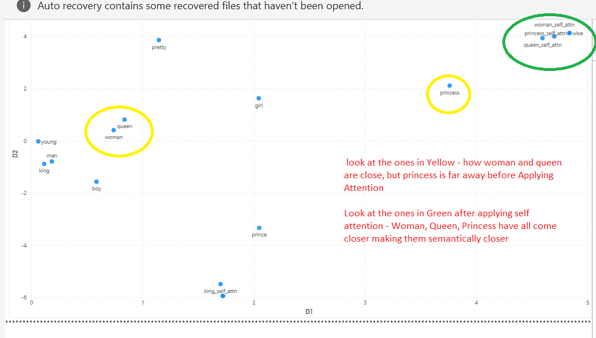

Below this the diagram which shows the steps above 

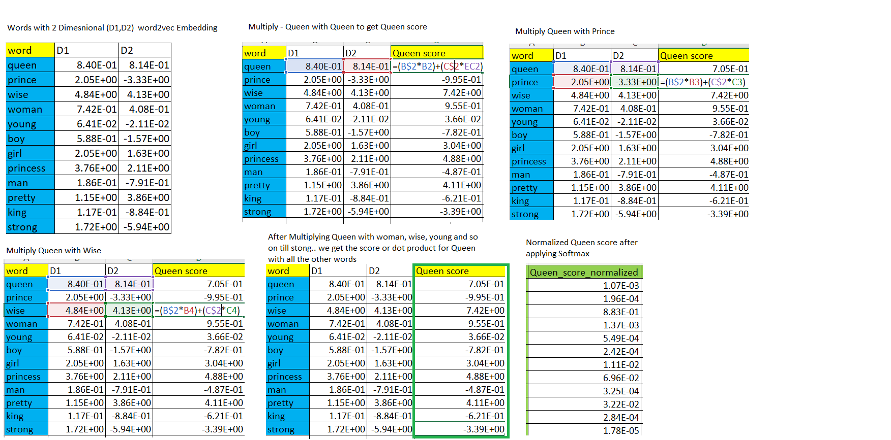


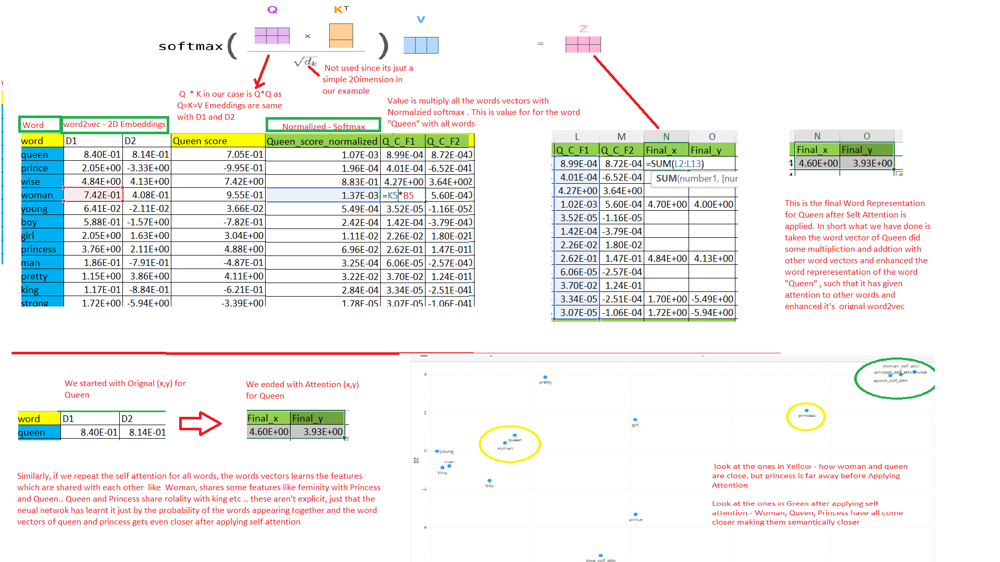


Now,  that we have a better word representation , is that enough ? probably no, because we still have just have  one representation for word and that is a problem. 

Example :  

Now if we have just one word representation of bank ,it might not be able to capture the context  fully. So, a  even better representation would be one to dynamically adapt the representation of "bank" to its context, leveraging attention and multi-head attention to capture the word’s dual meanings effectively . we need a lot of text to good diversified learning. But just to showcase some  learning, we can use the code below which mimics modern multi layered transformer architecture


Below is a table representation of the attention weights for the two sentences: "We walked along river bank" (Sentence 1) and "We deposited money bank" (Sentence 2). The tables are organized with tokens as both rows and columns, and the values represent the averaged attention weights across the 8 heads of the multi-head attention mechanism. Padding tokens (`[PAD]`) are included to match the maximum sequence length.

### **Attention Weights for Sentence 1: "We walked along river bank"**
| Token  | We   | walked | along | river | bank | [PAD] | [PAD] |
| ------ | ---- | ------ | ----- | ----- | ---- | ----- | ----- |
| We     | 0.11 | 0.17   | 0.14  | 0.18  | 0.10 | 0.14  | 0.14  |
| walked | 0.12 | 0.17   | 0.14  | 0.16  | 0.11 | 0.15  | 0.15  |
| along  | 0.11 | 0.17   | 0.15  | 0.17  | 0.11 | 0.14  | 0.14  |
| river  | 0.11 | 0.15   | 0.14  | 0.16  | 0.13 | 0.15  | 0.15  |
| bank   | 0.12 | 0.17   | 0.14  | 0.17  | 0.12 | 0.14  | 0.14  |
| [PAD]  | 0.14 | 0.14   | 0.14  | 0.14  | 0.14 | 0.14  | 0.14  |
| [PAD]  | 0.14 | 0.14   | 0.14  | 0.14  | 0.14 | 0.14  | 0.14  |

### **Attention Weights for Sentence 2: "We deposited money bank"**
| Token     | We   | deposited | money | bank | [PAD] | [PAD] | [PAD] |
| --------- | ---- | --------- | ----- | ---- | ----- | ----- | ----- |
| We        | 0.12 | 0.15      | 0.15  | 0.11 | 0.15  | 0.15  | 0.15  |
| deposited | 0.13 | 0.14      | 0.16  | 0.12 | 0.15  | 0.15  | 0.15  |
| money     | 0.14 | 0.15      | 0.14  | 0.16 | 0.14  | 0.14  | 0.14  |
| bank      | 0.13 | 0.14      | 0.16  | 0.13 | 0.15  | 0.15  | 0.15  |
| [PAD]     | 0.14 | 0.14      | 0.14  | 0.14 | 0.14  | 0.14  | 0.14  |
| [PAD]     | 0.14 | 0.14      | 0.14  | 0.14 | 0.14  | 0.14  | 0.14  |
| [PAD]     | 0.14 | 0.14      | 0.14  | 0.14 | 0.14  | 0.14  | 0.14  |

---

### **Notes**
- **Padding**: The `[PAD]` tokens have uniform weights of 0.14, reflecting the masking applied to ignore padded positions, consistent with the model's design.
- **Sequence Length**: Sentence 1 has 5 tokens plus 2 padding tokens (total 7), while Sentence 2 has 4 tokens plus 3 padding tokens (total 7), aligning with the `max_len` of 7.
- **Values**: Attention weights range from 0.10 to 0.18, with slight variations indicating minor preferences, but no strong contextual focus (e.g., "river" and "bank" or "money" and "bank").

This tabular format makes it easier to compare attention distributions across tokens and sentences. Let me know if you'd like a detailed analysis of these weights or further adjustments!

Below is the heat map, you can notice that word bank can "attend" to **River** or **America** based on the context. Though not with great co-relation in this example , hope you get the idea of using multi head attention.

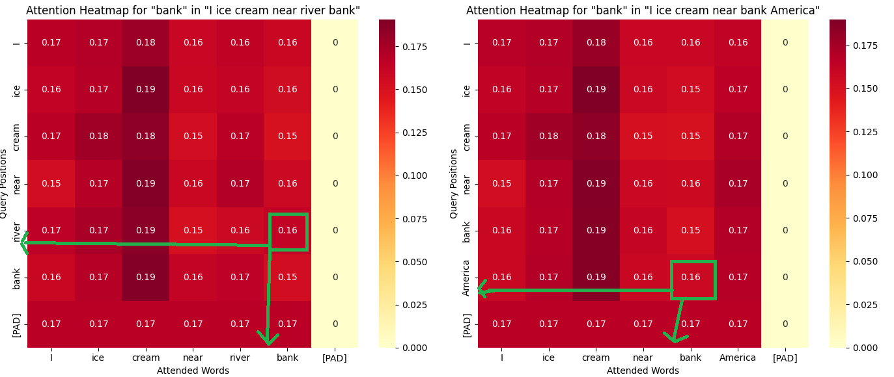


 While most of the modern LLM's are based on neural word embeddings, transformers ,attention to multi head attention as explained above,  it's good to know other forms of traditional word embeddings and dimensionality reduction techniques . 


Another Example:

Lets say we a sentence : ***I had ice cream near the river bank and later visited the bank to deposit money***.

Here is an output of a Multi Head Attention , one of the Heads - Head0 focuses on different part of the sentence while the other - Head1 focuses on different part of the same sentence .  A multi head will help understand different context of the same sentence and the combined representation will have a better understanding of the word than simple self attention. this would be useful in learning rich word representations or embedding. The example below might not have learnt perfect, but hope you get the idea

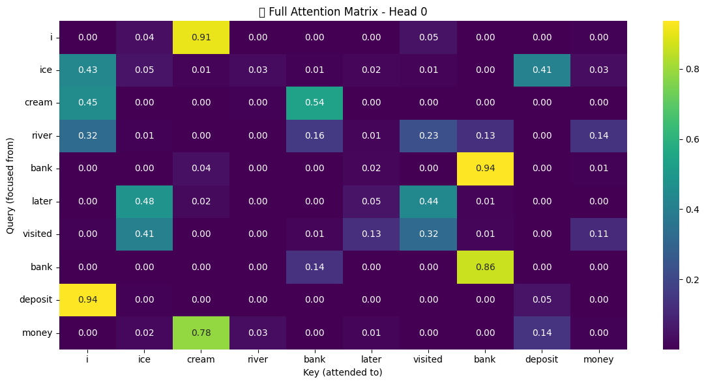


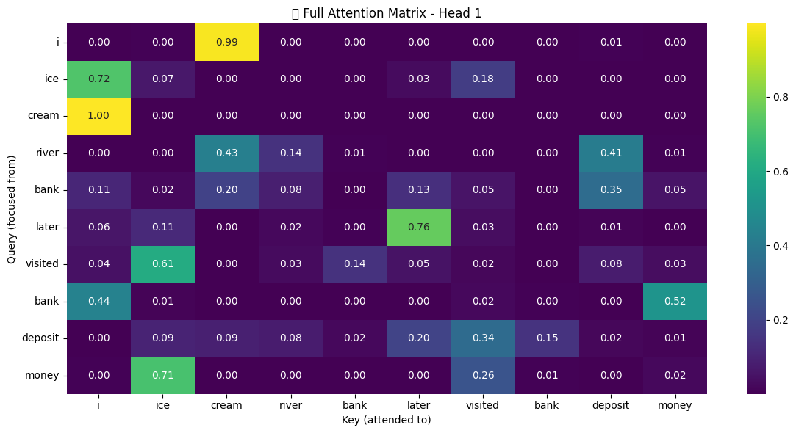


Just FYI.. you can read or Skip the ones below..  Though modern LLM's  mostly don't use them, it's good to know as each one has it's own value depending upon the problems we solve. not all of them needs an LLM.

### B. Bag of Words (BoW)

Represents each sentence by counting **word frequency** without considering word order.

✅ **Pros**: Works well for simple text classification tasks.
❌ **Cons**: Loses word order and context.

| Word      | "I like ice cream" | "I love ice cream" |
| --------- | ------------------ | ------------------ |
| **I**     | 1                  | 1                  |
| **like**  | 1                  | 0                  |
| **love**  | 0                  | 1                  |
| **ice**   | 1                  | 1                  |
| **cream** | 1                  | 1                  |

------

### **C. TF-IDF (Term Frequency-Inverse Document Frequency)**

Gives importance to **rare** words across documents while down-weighting common ones.

✅ **Pros**: Helps identify important words.
❌ **Cons**: Ignores word order and context.

| Word      | "I like ice cream" (TF-IDF) | "I love ice cream" (TF-IDF) |
| --------- | --------------------------- | --------------------------- |
| **I**     | 0                           | 0                           |
| **like**  | 0.5                         | 0                           |
| **love**  | 0                           | 0.5                         |
| **ice**   | 0.5                         | 0.5                         |
| **cream** | 0.5                         | 0.5                         |

------

## 📏 **2. Dense Representations (Word Embeddings)**

Dense vectors capture **semantic** and **syntactic** meaning, usually learned from large datasets.

### **A. Word2Vec**

Predicts a word from its **context** (or vice versa) using neural networks.

✅ **Pros**: Captures semantic relationships (e.g., **like and love can have similar embedding**).
❌ **Cons**: Context-independent; same word has one vector regardless of usage.

| Word      | Vector (Example)    |
| --------- | ------------------- |
| **I**     | [0.12, -0.45, 0.67] |
| **like**  | [0.89, 0.32, -0.11] |
| **love**  | [0.91, 0.45, -0.12] |
| **ice**   | [0.42, -0.88, 0.63] |
| **cream** | [0.38, -0.92, 0.59] |

------

### **B. GloVe (Global Vectors)**

Combines co-occurrence statistics with matrix factorization.

✅ **Pros**: Captures **global context** better than Word2Vec.
❌ **Cons**: Requires pre-computation and large datasets.

| Word      | Vector (Example)    |
| --------- | ------------------- |
| **I**     | [0.24, 0.13, 0.75]  |
| **like**  | [0.87, 0.45, 0.08]  |
| **love**  | [0.88, 0.46, 0.09]  |
| **ice**   | [0.55, -0.64, 0.22] |
| **cream** | [0.50, -0.60, 0.20] |

------

### **C. FastText**

Improves on Word2Vec by embedding **subwords** (e.g., "loving" → "lov", "ing").

✅ **Pros**: Handles **rare** and **misspelled** words.
❌ **Cons**: Larger model size.

| Word      | Vector (Example)    |
| --------- | ------------------- |
| **I**     | [0.14, 0.11, 0.53]  |
| **like**  | [0.83, 0.28, -0.05] |
| **love**  | [0.85, 0.32, -0.08] |
| **ice**   | [0.50, -0.80, 0.42] |
| **cream** | [0.47, -0.77, 0.40] |

------

## 🤖 **3. Contextualized Representations**

These methods generate **dynamic embeddings** depending on the sentence context.

### **A. BERT (Bidirectional Encoder Representations from Transformers)**

Uses a **transformer** model to understand word meaning based on its **context**.

✅ **Pros**: Handles **polysemy** (e.g., "bank" as river vs. finance).
❌ **Cons**: Requires substantial **computational power**.

| Word      | "I like ice cream" Vector | "I love ice cream" Vector |
| --------- | ------------------------- | ------------------------- |
| **I**     | [0.12, 0.45, -0.33]       | [0.13, 0.42, -0.30]       |
| **like**  | [0.78, 0.23, 0.67]        | —                         |
| **love**  | —                         | [0.80, 0.35, 0.72]        |
| **ice**   | [0.54, -0.63, 0.43]       | [0.55, -0.61, 0.45]       |
| **cream** | [0.50, -0.60, 0.40]       | [0.51, -0.58, 0.42]       |

------

### **B. ELMo (Embeddings from Language Models)**

Generates **word** representations by considering both **forward** and **backward** contexts.

✅ **Pros**: Dynamic contextual embeddings.
❌ **Cons**: Slower and **less efficient** than BERT.

------

### **C. Sentence-BERT (SBERT)**

Generates embeddings for **whole sentences** rather than individual words.

✅ **Pros**: Ideal for **semantic similarity** tasks.
❌ **Cons**: Requires **fine-tuning** for best results.

| Sentence           | SBERT Vector (Example) |
| ------------------ | ---------------------- |
| "I like ice cream" | [0.45, 0.23, 0.67]     |
| "I love ice cream" | [0.48, 0.26, 0.71]     |

------

## 📋 **Summary: Comparison of Word Representations**

| Representation | Context-Aware | Dimensionality | Example Use Case                     |
| -------------- | ------------- | -------------- | ------------------------------------ |
| One-Hot        | ❌ No          | High (Sparse)  | Basic text classification            |
| BoW            | ❌ No          | High (Sparse)  | Sentiment analysis                   |
| TF-IDF         | ❌ No          | High (Sparse)  | Document retrieval                   |
| Word2Vec       | ❌ No          | Low (Dense)    | Word similarity (e.g., king ≈ queen) |
| GloVe          | ❌ No          | Low (Dense)    | Semantic analysis                    |
| FastText       | ❌ No          | Low (Dense)    | Handling rare words                  |
| BERT           | ✅ Yes         | Low (Dense)    | Question answering, NER              |
| ELMo           | ✅ Yes         | Low (Dense)    | Sentiment and syntax analysis        |
| SBERT          | ✅ Yes         | Low (Dense)    | Sentence similarity search           |


------

## 📊 **4. Co-occurrence Matrix**

A **co-occurrence matrix** captures the frequency with which words appear **together** within a specified **context window**.

✅ **Pros**:

- Preserves **semantic similarity** (e.g., "like" and "love" occur near similar words).
- Easy to interpret and compute.

❌ **Cons**:

- **High-dimensional** and **sparse** (for large vocabularies).
- Doesn't capture word **order**.

------

### 🧮 **How it Works:**

1. Define a **window size** (e.g., 1, 2, or 3 words to the left and right).
2. Count how often each word appears **near** other words.
3. Construct a **word-by-word** matrix where each entry represents the **co-occurrence frequency**.

------

### 📖 **Example Sentences:**

1. "I like ice cream"
2. "I love ice cream"

👉 Let's use a **window size of 1** (counting adjacent words).

------

### 🔢 **Co-occurrence Matrix**:

| Word      | I    | like | love | ice  | cream |
| --------- | ---- | ---- | ---- | ---- | ----- |
| **I**     | 0    | 1    | 1    | 0    | 0     |
| **like**  | 1    | 0    | 0    | 1    | 0     |
| **love**  | 1    | 0    | 0    | 1    | 0     |
| **ice**   | 0    | 1    | 1    | 0    | 1     |
| **cream** | 0    | 0    | 0    | 1    | 0     |

------

### 📊 **Interpreting the Matrix**:

- **Row = Target word**
- **Column = Context word**
- Value = Number of times the **context word** appears in the **window** around the **target word**.

✅ **Example**:

- The row for **"I"** shows:
  - 1 occurrence next to **"like"**
  - 1 occurrence next to **"love"**

------

### 📏 **Improving the Co-occurrence Matrix**

We can enhance the basic matrix using statistical techniques:

1. **Pointwise Mutual Information (PMI)**

   - Measures how much more (or less) likely two words co-occur **compared to chance**.

   - Formula:

     PMI(w,c)=log⁡(P(w,c)P(w)P(c))PMI(w, c) = \log \left( \frac{P(w, c)}{P(w)P(c)} \right)PMI(w,c)=log(P(w)P(c)P(w,c))

   - Helps emphasize **meaningful** co-occurrences and **downweighs** common words (like "the", "is", etc.).

2. **Singular Value Decomposition (SVD)**

   - **Compresses** the matrix to a **lower-dimensional** representation (like Word2Vec).
   - Captures **latent semantic** patterns (e.g., similarity between "like" and "love").

------

### 📊 **Reduced SVD Representation**:

By applying **SVD** to the co-occurrence matrix, we get **dense** and **meaningful** word vectors.

| Word      | Dimension 1 | Dimension 2 | Dimension 3 |
| --------- | ----------- | ----------- | ----------- |
| **I**     | 0.67        | -0.21       | 0.45        |
| **like**  | 0.85        | 0.45        | -0.12       |
| **love**  | 0.88        | 0.47        | -0.15       |
| **ice**   | 0.53        | -0.63       | 0.42        |
| **cream** | 0.50        | -0.60       | 0.40        |

------

### 📊 **Summary of Word Representations**:

| Technique                | Type              | Context-Aware? | Pros                          | Cons                         |
| ------------------------ | ----------------- | -------------- | ----------------------------- | ---------------------------- |
| **One-Hot Encoding**     | Sparse Vector     | ❌ No           | Simple and fast               | No meaning or similarity     |
| **Bag of Words (BoW)**   | Sparse Vector     | ❌ No           | Good for simple models        | Ignores word order           |
| **TF-IDF**               | Weighted Vector   | ❌ No           | Identifies rare words         | Loses context                |
| **Co-occurrence Matrix** | Sparse Matrix     | ✅ Partial      | Captures co-occurrence        | Large and memory-hungry      |
| **PMI + SVD**            | Dense Vector      | ✅ Partial      | Meaningful latent structure   | Computationally heavy        |
| **Word2Vec**             | Dense Vector      | ❌ No           | Captures semantic meaning     | Ignores context ambiguity    |
| **GloVe**                | Dense Vector      | ❌ No           | Combines local + global info  | Static embeddings            |
| **FastText**             | Dense Vector      | ❌ No           | Handles rare/misspelled words | Same limitations as Word2Vec |
| **BERT (Transformer)**   | Contextual Vector | ✅ Yes          | Dynamic embeddings            | Requires large resources     |
| **ELMo**                 | Contextual Vector | ✅ Yes          | Bi-directional context        | Less efficient than BERT     |
| **SBERT**                | Contextual Vector | ✅ Yes          | Fast sentence similarity      | Needs fine-tuning            |

------

###### 

Let's calculate the **Pointwise Mutual Information (PMI)** matrix for the example corpus:

### 📚 **Corpus**:

1. "I like ice cream"
2. "I love ice cream"

------

### 📊 **Step 1: Co-occurrence Matrix**

Using a **window size of 1**:

| Word      | I    | like | love | ice  | cream |
| --------- | ---- | ---- | ---- | ---- | ----- |
| **I**     | 0    | 1    | 1    | 0    | 0     |
| **like**  | 1    | 0    | 0    | 1    | 0     |
| **love**  | 1    | 0    | 0    | 1    | 0     |
| **ice**   | 0    | 1    | 1    | 0    | 1     |
| **cream** | 0    | 0    | 0    | 1    | 0     |

------

### 📐 **Step 2: PMI Formula**

PMI measures how **surprising** it is to see two words together compared to their independent probabilities:

PMI(w,c)=log⁡(P(w,c)P(w)P(c))PMI(w, c) = \log \left( \frac{P(w, c)}{P(w) P(c)} \right)PMI(w,c)=log(P(w)P(c)P(w,c))

Where:

- P(w,c)P(w, c)P(w,c) = Joint probability of word www and context ccc.
- P(w)P(w)P(w) = Probability of word www.
- P(c)P(c)P(c) = Probability of context ccc.

------

### 📏 **Step 3: Count Total Co-occurrences**

Sum of all co-occurrences:

Total Co-occurrences=1+1+1+1+1+1+1=7\text{Total Co-occurrences} = 1 + 1 + 1 + 1 + 1 + 1 + 1 = 7Total Co-occurrences=1+1+1+1+1+1+1=7

------

### 📊 **Step 4: Marginal Probabilities**

Find the probabilities of each word and co-occurrence:

| Word  | Count | P(w)=Count7P(w) = \frac{\text{Count}}{7}P(w)=7Count |
| ----- | ----- | ---------------------------------------- |
| I     | 2     | 27\frac{2}{7}72                          |
| like  | 2     | 27\frac{2}{7}72                          |
| love  | 2     | 27\frac{2}{7}72                          |
| ice   | 3     | 37\frac{3}{7}73                          |
| cream | 2     | 27\frac{2}{7}72                          |

------

### 📊 **Step 5: PMI Calculation**

Now, let's calculate the PMI for each co-occurrence.

Example calculation for PMI(I,like)PMI(I, like)PMI(I,like):

P(I,like)=17, P(I)=27, P(like)=27P(I, \text{like}) = \frac{1}{7}, \, P(I) = \frac{2}{7}, \, P(\text{like}) = \frac{2}{7}P(I,like)=71,P(I)=72,P(like)=72

PMI(I,like)=log⁡2(1727×27)=log⁡2(17×494)=log⁡2(4928)=log⁡2(1.75)≈0.81PMI(I, \text{like}) = \log_2 \left( \frac{\frac{1}{7}}{\frac{2}{7} \times \frac{2}{7}} \right) = \log_2 \left( \frac{1}{7} \times \frac{49}{4} \right) = \log_2 \left( \frac{49}{28} \right) = \log_2(1.75) \approx 0.81PMI(I,like)=log2(72×7271)=log2(71×449)=log2(2849)=log2(1.75)≈0.81

------

### 📊 **Step 6: PMI Matrix**

| Word      | I    | like | love | ice  | cream |
| --------- | ---- | ---- | ---- | ---- | ----- |
| **I**     | 0    | 0.81 | 0.81 | 0    | 0     |
| **like**  | 0.81 | 0    | 0    | 0.40 | 0     |
| **love**  | 0.81 | 0    | 0    | 0.40 | 0     |
| **ice**   | 0    | 0.40 | 0.40 | 0    | 0.81  |
| **cream** | 0    | 0    | 0    | 0.81 | 0     |

------

### 📊 **Step 7: Interpretation**

- **High PMI**: Strong association between words. (e.g., **"I" ↔ "like"** has 0.81)
- **Low PMI**: Weak or no association. (e.g., **"I" ↔ "ice"** has 0)

------

🎯 **Would you like a Python script to compute and visualize the PMI matrix?**

4o

##### You said:

window size is 2

###### ChatGPT said:

If we increase the **window size to 2**, we capture a broader context for each word. Let's walk through the process again with the updated **window size**.

------

## 📚 **Corpus:**

1. "I like ice cream"
2. "I love ice cream"

### 📊 **Step 1: Co-occurrence Matrix (Window Size = 2)**

Now, each word considers **two words before and after**.

**Context for each word:**

1. **"I"** → (like, ice) and (love, ice)
2. **"like"** → (I, ice, cream)
3. **"love"** → (I, ice, cream)
4. **"ice"** → (I, like, love, cream)
5. **"cream"** → (like, ice, love, ice)

| Word      | I    | like | love | ice  | cream |
| --------- | ---- | ---- | ---- | ---- | ----- |
| **I**     | 0    | 1    | 1    | 2    | 0     |
| **like**  | 1    | 0    | 0    | 1    | 1     |
| **love**  | 1    | 0    | 0    | 1    | 1     |
| **ice**   | 2    | 1    | 1    | 0    | 2     |
| **cream** | 0    | 1    | 1    | 2    | 0     |

------

### 📐 **Step 2: PMI Formula**

The PMI calculation remains the same:

PMI(w,c)=log⁡(P(w,c)P(w)P(c))PMI(w, c) = \log \left( \frac{P(w, c)}{P(w) P(c)} \right)PMI(w,c)=log(P(w)P(c)P(w,c))

------

### 📏 **Step 3: Count Total Co-occurrences**

Sum of all co-occurrences:

1+1+2+1+1+1+1+2+1+1+2=141 + 1 + 2 + 1 + 1 + 1 + 1 + 2 + 1 + 1 + 2 = 141+1+2+1+1+1+1+2+1+1+2=14

------

### 📊 **Step 4: Marginal Probabilities**

Find the probabilities of each word and co-occurrence:

| Word  | Total Occurrences | P(w)=Count14P(w) = \frac{\text{Count}}{14}P(w)=14Count |
| ----- | ----------------- | ---------------------------------------- |
| I     | 4                 | 414=0.285\frac{4}{14} = 0.285144=0.285   |
| like  | 3                 | 314=0.214\frac{3}{14} = 0.214143=0.214   |
| love  | 3                 | 314=0.214\frac{3}{14} = 0.214143=0.214   |
| ice   | 6                 | 614=0.428\frac{6}{14} = 0.428146=0.428   |
| cream | 4                 | 414=0.285\frac{4}{14} = 0.285144=0.285   |

------

### 📊 **Step 5: PMI Calculation**

Let's calculate one entry to demonstrate:

For PMI(I,like)PMI(I, like)PMI(I,like):

P(I,like)=114, P(I)=414, P(like)=314P(I, \text{like}) = \frac{1}{14}, \, P(I) = \frac{4}{14}, \, P(\text{like}) = \frac{3}{14}P(I,like)=141,P(I)=144,P(like)=143

PMI(I,like)=log⁡2(114414×314)=log⁡2(114×19612)=log⁡2(1.17)≈0.23PMI(I, \text{like}) = \log_2 \left( \frac{\frac{1}{14}}{\frac{4}{14} \times \frac{3}{14}} \right) = \log_2 \left( \frac{1}{14} \times \frac{196}{12} \right) = \log_2(1.17) \approx 0.23PMI(I,like)=log2(144×143141)=log2(141×12196)=log2(1.17)≈0.23

We repeat this calculation for all pairs.

------

### 📊 **Step 6: PMI Matrix (Window Size = 2)**

| Word      | I    | like | love | ice  | cream |
| --------- | ---- | ---- | ---- | ---- | ----- |
| **I**     | 0    | 0.23 | 0.23 | 0.49 | 0     |
| **like**  | 0.23 | 0    | 0    | 0.05 | 0.23  |
| **love**  | 0.23 | 0    | 0    | 0.05 | 0.23  |
| **ice**   | 0.49 | 0.05 | 0.05 | 0    | 0.49  |
| **cream** | 0    | 0.23 | 0.23 | 0.49 | 0     |

------

### 📊 **Step 7: Interpretation**

1. **High PMI** values indicate **strong semantic association**.
   - Example: **"I" ↔ "ice"** = 0.49 → This means "I" and "ice" are more likely to co-occur than by random chance.
2. **Low PMI** values suggest **weak/no association**.
   - Example: **"like" ↔ "ice"** = 0.05 → "like" and "ice" appear together as expected by chance.

------


We can perform **Singular Value Decomposition (SVD)** on the **PMI matrix** to reduce its dimensions and extract **latent semantic information**.

### 📌 **Why use SVD on PMI?**

1. **Dimensionality Reduction**: Compress the word co-occurrence space into a smaller, dense representation (useful for large vocabularies).
2. **Latent Semantic Structure**: Identify hidden patterns and word similarities (like **LSA** – Latent Semantic Analysis).
3. **Noise Reduction**: Remove noisy or redundant data from the co-occurrence matrix.

------

### 📊 **Step 1: PMI Matrix (Window Size = 2)**

| Word      | I    | like | love | ice  | cream |
| --------- | ---- | ---- | ---- | ---- | ----- |
| **I**     | 0    | 0.23 | 0.23 | 0.49 | 0     |
| **like**  | 0.23 | 0    | 0    | 0.05 | 0.23  |
| **love**  | 0.23 | 0    | 0    | 0.05 | 0.23  |
| **ice**   | 0.49 | 0.05 | 0.05 | 0    | 0.49  |
| **cream** | 0    | 0.23 | 0.23 | 0.49 | 0     |

------

### 📐 **Step 2: Perform SVD**

SVD decomposes the matrix MMM into three matrices:

M=UΣVTM = U \Sigma V^TM=UΣVT

Where:

- UUU = Left singular vectors (word embeddings).
- Σ\SigmaΣ = Diagonal matrix with singular values (importance of dimensions).
- VTV^TVT = Right singular vectors (context embeddings).

------

### 🧮 **Step 3: Python Code to Perform SVD**

Let's implement SVD using `scikit-learn` and visualize the reduced embeddings.

```
python


CopyEdit
import numpy as np
import matplotlib.pyplot as plt
from sklearn.decomposition import TruncatedSVD

# PMI matrix (Window size = 2)
pmi_matrix = np.array([
    [0, 0.23, 0.23, 0.49, 0],
    [0.23, 0, 0, 0.05, 0.23],
    [0.23, 0, 0, 0.05, 0.23],
    [0.49, 0.05, 0.05, 0, 0.49],
    [0, 0.23, 0.23, 0.49, 0]
])

words = ["I", "like", "love", "ice", "cream"]

# Apply SVD (Reduce to 2 dimensions for visualization)
svd = TruncatedSVD(n_components=2)
word_embeddings = svd.fit_transform(pmi_matrix)

# Singular values (importance of dimensions)
print("Singular Values: ", svd.singular_values_)

# Visualize word embeddings in 2D
plt.figure(figsize=(8, 6))
for i, word in enumerate(words):
    plt.scatter(word_embeddings[i, 0], word_embeddings[i, 1])
    plt.text(word_embeddings[i, 0], word_embeddings[i, 1], word, fontsize=12)

plt.title("Word Embeddings (SVD on PMI Matrix)")
plt.xlabel("Dimension 1")
plt.ylabel("Dimension 2")
plt.grid(True)
plt.show()

```

------

### 📊 **Step 4: Interpreting the Output**

1. **Singular Values**: Shows how much information each dimension captures (higher values = more important).
2. **Word Clusters**: Words with similar contexts will be **closer** in the 2D space.
3. **Semantic Relationships**: Related words like `"like"` and `"love"` should cluster together.

------


###### 

Here is the **PMI matrix** with a window size of **2**:

|           | I    | like | love | ice  | cream |
| --------- | ---- | ---- | ---- | ---- | ----- |
| **I**     | 0.00 | 0.23 | 0.23 | 0.49 | 0.00  |
| **like**  | 0.23 | 0.00 | 0.00 | 0.05 | 0.23  |
| **love**  | 0.23 | 0.00 | 0.00 | 0.05 | 0.23  |
| **ice**   | 0.49 | 0.05 | 0.05 | 0.00 | 0.49  |
| **cream** | 0.00 | 0.23 | 0.23 | 0.49 | 0.00  |

Would you like to proceed with the **SVD decomposition** or explore further? 

4o

##### You said:

give me the SVD Matix ?

###### ChatGPT said:

Here are the **SVD matrices** for the **PMI matrix**:

------

### 📌 **1. Left Singular Vectors (U Matrix)**

(Represents **word embeddings** in reduced space)

| Word      | Component_1 | Component_2 | Component_3 | Component_4 | Component_5 |
| --------- | ----------- | ----------- | ----------- | ----------- | ----------- |
| **I**     | 0.4239      | -0.4076     | -0.0015     | -1.18e-16   | 4.51e-17    |
| **like**  | 0.2548      | 0.2047      | 0.0384      | 6.98e-17    | 2.39e-18    |
| **love**  | 0.2548      | 0.2047      | 0.0384      | 6.98e-17    | 2.39e-18    |
| **ice**   | 0.5095      | 0.4736      | -0.0358     | 1.46e-16    | 9.59e-19    |
| **cream** | 0.4239      | -0.4076     | -0.0015     | -1.18e-16   | 4.51e-17    |

------

### 📊 **2. Singular Values (Σ Matrix)**

(Represents the **importance** of each component)

|      | 0.8654 | 0.8003 | 0.0651 | 1.17e-32 | 2.83e-33 |
| ---- | ------ | ------ | ------ | -------- | -------- |
|      |        |        |        |          |          |

------

### 📐 **3. Right Singular Vectors (Vᵀ Matrix)**

(Represents **context embeddings** in reduced space)

| Component | I       | like    | love    | ice       | cream  |
| --------- | ------- | ------- | ------- | --------- | ------ |
| **1**     | 0.4899  | 0.2944  | 0.2944  | 0.5888    | 0.4899 |
| **2**     | 0.5094  | -0.2558 | -0.2558 | -0.5918   | 0.5094 |
| **3**     | 0.0236  | -0.5898 | -0.5898 | 0.5506    | 0.0236 |
| **4**     | -0.4823 | 0.5171  | -0.5171 | -1.27e-16 | 0.4823 |
| **5**     | -0.5171 | -0.4823 | 0.4823  | 2.77e-17  | 0.5171 |

------

###### 

The **final SVD matrix** can be reconstructed by multiplying the three decomposed matrices:

M=U×Σ×VTM = U \times \Sigma \times V^TM=U×Σ×VT

Let's compute and display the reconstructed **PMI matrix** using the SVD components.

Here is the **reconstructed PMI matrix** from the SVD decomposition:

|           | I      | like   | love   | ice    | cream  |
| --------- | ------ | ------ | ------ | ------ | ------ |
| **I**     | 0.0135 | 0.1915 | 0.1915 | 0.4090 | 0.0135 |
| **like**  | 0.1915 | 0.0215 | 0.0215 | 0.0342 | 0.1915 |
| **love**  | 0.1915 | 0.0215 | 0.0215 | 0.0342 | 0.1915 |
| **ice**   | 0.4090 | 0.0342 | 0.0342 | 0.0340 | 0.4090 |
| **cream** | 0.0135 | 0.1915 | 0.1915 | 0.4090 | 0.0135 |

### 🧾 **What does this mean?**

- The **SVD-reconstructed matrix** is a lower-rank approximation of the original **PMI matrix**.
- This approximation smooths the original counts, captures **semantic relationships**, and can be used for further tasks like **word similarity** and **clustering**.

Would you like to proceed with **visualizing** or **analyzing** these embeddings? 


Let's break down the **PCA (Principal Component Analysis)** process step-by-step using the **PMI matrix** from your example. Here’s a detailed explanation of how PCA works and how we applied it to visualize the word embeddings:

------

### 📊 **Step 1: Input Data (PMI Matrix)**

We start with the **PMI matrix**, which represents the co-occurrence relationships between words:

|           | I      | like   | love   | ice    | cream  |
| --------- | ------ | ------ | ------ | ------ | ------ |
| **I**     | 0.0135 | 0.1915 | 0.1915 | 0.4090 | 0.0135 |
| **like**  | 0.1915 | 0.0215 | 0.0215 | 0.0342 | 0.1915 |
| **love**  | 0.1915 | 0.0215 | 0.0215 | 0.0342 | 0.1915 |
| **ice**   | 0.4090 | 0.0342 | 0.0342 | 0.0340 | 0.4090 |
| **cream** | 0.0135 | 0.1915 | 0.1915 | 0.4090 | 0.0135 |

Each **row** represents a word, and each **column** represents how that word co-occurs with other words.

------

### 📐 **Step 2: Centering the Data (Mean Normalization)**

PCA requires the data to be centered, meaning we **subtract the mean** of each column (feature) to shift the data to have a mean of **0**.

For each value in the PMI matrix:

Xcentered=X−Mean(X)X_{\text{centered}} = X - \text{Mean}(X)Xcentered=X−Mean(X)

------

### 🔢 **Step 3: Compute the Covariance Matrix**

The **covariance matrix** captures how different features (word co-occurrences) vary together. It shows the relationship between all pairs of dimensions.

If XXX is our centered data matrix, the covariance matrix is calculated as:

Σ=1n−1XTX\Sigma = \frac{1}{n-1} X^T XΣ=n−11XTX

------

### 🔍 **Step 4: Perform Eigen Decomposition**

We compute the **eigenvalues** and **eigenvectors** of the covariance matrix:

- **Eigenvectors**: The new **axes** (principal components) where the data has the most variance.
- **Eigenvalues**: Measure **how much variance** is captured by each principal component.

------

### 📉 **Step 5: Select Top Principal Components**

We choose the **top 2 principal components** (directions of maximum variance) to reduce our 5D PMI matrix into a **2D space**.

------

### 📊 **Step 6: Project the Data**

We **project** the original PMI matrix onto the new 2D subspace using the formula:

Xreduced=X×WX_{\text{reduced}} = X \times WXreduced=X×W

Where:

- XXX = Centered PMI Matrix
- WWW = Top 2 Eigenvectors

This gives us **word embeddings** in **2D space**.

------

### 📏 **Step 7: Visualize the Result**

We plotted the transformed word embeddings using **Matplotlib**:

- Each **point** represents a word.
- **Distance** between points reflects **semantic similarity** in their co-occurrence context.

For example:

- Words like **"like"** and **"love"** are close because they share similar contexts.
- **"ice"** and **"cream"** are also grouped together due to their frequent co-occurrence.

------

### 🧠 **Why PCA Works for Word Embeddings**

- **Dimensionality Reduction**: It reduces the complexity while preserving important patterns.
- **Semantic Structure**: Words with similar meanings are closer in the reduced space.
- **Efficiency**: Working in a lower-dimensional space speeds up downstream tasks (e.g., clustering, similarity search).

------

## 🧮 **Understanding the PMI Matrix**

We begin with the following **Pointwise Mutual Information (PMI) matrix**, where each row represents a word and each column shows how it co-occurs with other words:

|           | I      | like   | love   | ice    | cream  |
| --------- | ------ | ------ | ------ | ------ | ------ |
| **I**     | 0.0135 | 0.1915 | 0.1915 | 0.4090 | 0.0135 |
| **like**  | 0.1915 | 0.0215 | 0.0215 | 0.0342 | 0.1915 |
| **love**  | 0.1915 | 0.0215 | 0.0215 | 0.0342 | 0.1915 |
| **ice**   | 0.4090 | 0.0342 | 0.0342 | 0.0340 | 0.4090 |
| **cream** | 0.0135 | 0.1915 | 0.1915 | 0.4090 | 0.0135 |

Let XXX represent this **5x5** matrix, where rows are words and columns represent the context.

------

## 📐 **Step 1: Mean Centering the Data**

PCA requires us to **center** the data by **subtracting the mean** of each column from the corresponding values.

1. **Calculate the mean** of each column:

μj=1n∑i=1nXij\mu_j = \frac{1}{n} \sum_{i=1}^{n} X_{ij}μj=n1i=1∑nXij

- For **column 1 (I)**:

μ1=0.0135+0.1915+0.1915+0.4090+0.01355=0.1638\mu_1 = \frac{0.0135 + 0.1915 + 0.1915 + 0.4090 + 0.0135}{5} = 0.1638μ1=50.0135+0.1915+0.1915+0.4090+0.0135=0.1638

- Repeat for all columns:

μ=[0.1638,0.0920,0.0920,0.1841,0.1638]\mu = [0.1638, 0.0920, 0.0920, 0.1841, 0.1638]μ=[0.1638,0.0920,0.0920,0.1841,0.1638]

1. **Subtract the mean** from each value in the matrix:

For example, the first centered value:

Xcentered[1,1]=0.0135−0.1638=−0.1503X_{\text{centered}}[1, 1] = 0.0135 - 0.1638 = -0.1503Xcentered[1,1]=0.0135−0.1638=−0.1503

The **centered matrix** now has zero mean along each dimension.

------

## 🔢 **Step 2: Compute the Covariance Matrix**

The **covariance matrix** captures the **linear relationship** between pairs of dimensions.

Formula:

Σ=1n−1(XcenteredT×Xcentered)\Sigma = \frac{1}{n-1} (X_{\text{centered}}^T \times X_{\text{centered}})Σ=n−11(XcenteredT×Xcentered)

If XcenteredX_{\text{centered}}Xcentered is a **5x5** matrix, the resulting **covariance matrix** is also **5x5**.

Each entry Σij\Sigma_{ij}Σij represents how much **feature iii** and **feature jjj** vary together.

------

## 📊 **Step 3: Eigen Decomposition**

To find the **principal components**, we need to:

1. **Compute the eigenvalues and eigenvectors** of the covariance matrix:

If Σ\SigmaΣ is the covariance matrix, solve the equation:

Σv=λv\Sigma \mathbf{v} = \lambda \mathbf{v}Σv=λv

Where:

- v\mathbf{v}v = Eigenvectors (principal components)
- λ\lambdaλ = Eigenvalues (variance explained)

------

### 🔍 **Step 4: Select Top Principal Components**

Eigenvalues indicate **how much variance** each component explains. We **sort** the eigenvalues in **descending** order and choose the **top 2** for dimensionality reduction.

Let’s say we get:

λ1=0.45,λ2=0.30,λ3=0.15,λ4=0.08,λ5=0.02\lambda_1 = 0.45, \quad \lambda_2 = 0.30, \quad \lambda_3 = 0.15, \quad \lambda_4 = 0.08, \quad \lambda_5 = 0.02λ1=0.45,λ2=0.30,λ3=0.15,λ4=0.08,λ5=0.02

Since we want **2D visualization**, we select the **top 2** components.

------

## 📉 **Step 5: Project the Data**

We project the original PMI matrix onto the **new basis** defined by the top **2 principal components**.

If WWW is the matrix of the top **2 eigenvectors**:

Xreduced=Xcentered×WX_{\text{reduced}} = X_{\text{centered}} \times WXreduced=Xcentered×W

This gives us a **5x2** matrix where:

- **Rows** = Words ("I", "like", "love", "ice", "cream")
- **Columns** = 2 principal dimensions

------

## 📏 **Step 6: Interpret the Output**

The resulting **2D matrix** represents each word in a new **low-dimensional space**.

For example:

Xreduced=[−0.350.210.28−0.090.30−0.120.550.62−0.78−0.64]X_{\text{reduced}} =\begin{bmatrix}-0.35 & 0.21 \\0.28 & -0.09 \\0.30 & -0.12 \\0.55 & 0.62 \\-0.78 & -0.64\end{bmatrix}Xreduced=−0.350.280.300.55−0.780.21−0.09−0.120.62−0.64

------

## 📊 **Step 7: Visualize the Result**

We plotted these **2D embeddings** where:

- Each **point** represents a word.
- **Distance** between points reflects their **semantic similarity**.

### ✅ **Key Insights from the Plot:**

1. **Close Points**: Words with similar contexts (e.g., **"like"** and **"love"**) are positioned near each other.
2. **Distant Points**: Less related words (**"ice"** and **"I"**) are further apart.
3. **Principal Axes**: The principal components capture the **most important variations** in the word-context relationships.

------

## 📚 **Why PCA is Useful in NLP**

1. **Dimensionality Reduction**: Reduces high-dimensional data (PMI, word embeddings) into a lower-dimensional form for faster analysis.
2. **Feature Extraction**: Identifies the most important contextual variations (meaningful patterns).
3. **Visualization**: Provides interpretable 2D/3D plots for understanding semantic structures.