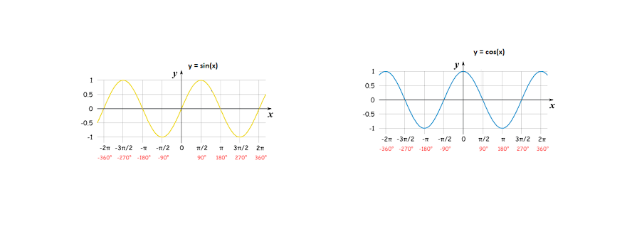
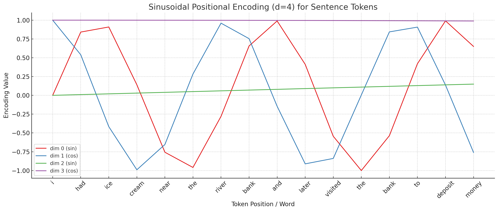
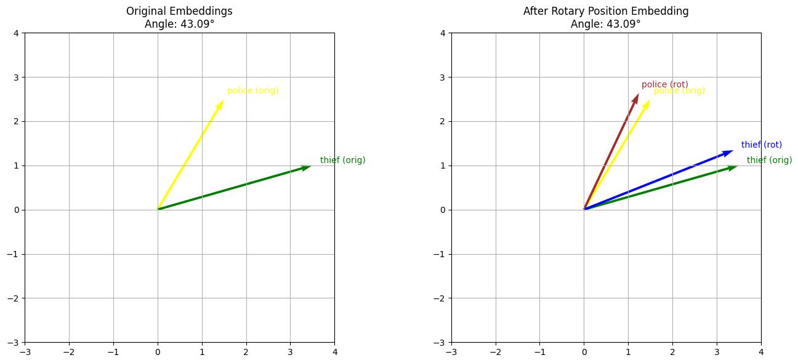
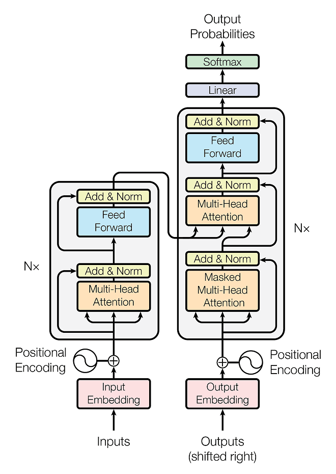
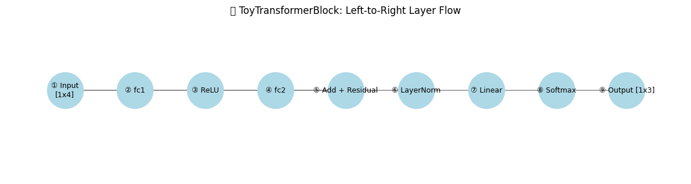

## How does LLM work ? - Part 4 

### **Transformers**

So far, we have seen Reinforcement Learning - Q Learning (Frozen Lake Example), Deep Q Learning (Frozen Lake Example), extended to play a word prediction using Reinforcement Learning, then word representations using word vectors, word2vec (Supervised Learning ),  Self Attention and Multi Head Attention .

We have now good understanding of basics that we can move into working of a base transformer.


Lets first go through the basic Architecture

#### **Transformer Architecture**

The Transformer consists of an **encoder-decoder** structure, commonly used for tasks like machine translation. Here’s a breakdown:

#### **1. Overall Structure**

- **Encoder**: Processes the input sequence (e.g., source language) into a set of continuous representations.
- **Decoder**: Generates the output sequence (e.g., target language) based on the encoder’s representations and previously generated tokens.
- **Stacking**: Both encoder and decoder consist of 6 identical layers (though this number is configurable).

#### **2. Encoder**

- **Input Embedding**: Converts input tokens into dense vectors of dimension d_model (e.g., 512).

- **Positional Encoding**: Adds sinusoidal encodings to the embeddings to preserve token order.

- Layer Structure

   (repeated 6 times):

  - **Multi-Head Self-Attention**: Allows each token to attend to all tokens in the input sequence.
  - **Add & Norm**: Adds a residual connection and applies layer normalization.
  - **Feed-Forward Network (FFN)**: A position-wise fully connected network with ReLU activation, applied independently to each token.
  - **Add & Norm**: Another residual connection and normalization.

- **Output**: A set of vectors (one per input token) passed to the decoder.

#### **3. Decoder**

- **Input Embedding and Positional Encoding**: Similar to the encoder, but for the target sequence (shifted right during training to predict the next token).

- Layer Structure

   (repeated 6 times):

  - **Masked Multi-Head Self-Attention**: Ensures the decoder only attends to previous positions in the output sequence (using a mask to prevent attending to future tokens).
  - **Add & Norm**.
  - **Multi-Head Attention (Encoder-Decoder Attention)**: Allows the decoder to attend to the encoder’s output.
  - **Add & Norm**.
  - **Feed-Forward Network**: Same as in the encoder.
  - **Add & Norm**.

- **Output**: A vector for each position, passed through a linear layer and softmax to predict the next token.

#### **4. Final Linear and Softmax Layer**

- The decoder’s output is projected to the vocabulary size via a linear transformation, followed by a softmax to generate probability distributions over target tokens.

------

### **Core Mechanisms**

#### **1. Self-Attention**

- **Definition**: Each token generates a query (Q), key (K), and value (V) vector through linear transformations of its input embedding.
- **Attention Score**: Computed as:
- $Attention(Q,K,V)= \text{softmax}\left(\frac{QK^T}{\sqrt{d_k}}\right)V$ 
- where dk is the dimension of the keys, and scaling prevents large values that could lead to small gradients.
- **Purpose**: Allows the model to weigh the importance of all tokens relative to each other, capturing dependencies regardless of distance.

#### **2. Multi-Head Attention**

- **Process**: Runs h (e.g., 8) parallel attention operations, each with its own Q, K, and V projections (dimension dk/hd_k / hdk/h).

- **Concatenation**: The outputs of all heads are concatenated and linearly transformed:

  $MultiHead(Q,K,V)= \text{Concat}(\text{head}_1, \dots, \text{head}_h)W$

  ​

- **Advantage**: Enables the model to jointly attend to information from different representation subspaces, improving expressiveness.

#### **3. Positional Encoding**

- **Formula**: Uses sine and cosine functions of different frequencies:

- $PE(pos,2i)= \sin\left(\frac{pos}{10000^{2i/d_{\text{model}}}}\right)$

  ​

- $PE(pos,2i+1)= \cos\left(\frac{pos}{10000^{2i/d_{\text{model}}}}\right)​$

  ​

  where pos is the position and i is the dimension.

- **Purpose**: Provides the model with information about token order, as the Transformer lacks recurrence.

#### **4. Residual Connections and Layer Normalization**

- **Residual Connection**: Adds the input of a sub-layer to its output $(x)x+SubLayer(x))$ to ease gradient flow.
- **Layer Normalization**: Normalizes the output across the feature dimension, stabilizing training.

#### **5. Feed-Forward Network**

- **Structure**: Two linear transformations with a ReLU activation

  ${FFN}(x) = \max(0, xW_1 + b_1)W_2 + b_2$

  ​

- **Purpose**: Applies a non-linear transformation to each position independently, adding capacity to the model.

------

### **Training and Optimization**

- **Dataset**: The model was trained on the WMT 2014 English-to-German and English-to-French datasets.

- **Optimizer**: Uses Adam with a custom learning rate schedule:

  $lrate = d_{\text{model}}^{-0.5} \cdot \min(\text{step\_num}^{-0.5}, \text{step\_num} \cdot \text{warmup\_steps}^{-1.5})$

  ​

  where a warmup phase gradually increases the learning rate.

- **Label Smoothing**: Applied to prevent overconfidence, improving generalization.

------

### **Performance and Impact**

- **Results**: The Transformer outperformed previous state-of-the-art models on machine translation tasks, achieving BLEU scores of 28.4 on English-to-German and 41.0 on English-to-French, surpassing RNN-based models.
- Advantages:
  - **Speed**: Trains significantly faster due to parallelism (e.g., 3.5 days on 8 P100 GPUs vs. weeks for RNNs).
  - **Scalability**: Handles longer sequences and larger datasets effectively.
  - **Flexibility**: Applicable beyond translation (e.g., text generation, classification).
- **Legacy**: The architecture inspired subsequent models like BERT (encoder-only), GPT (decoder-only), and T5, dominating NLP research and applications.


**Positional Embedding**

Sinusoidal positional embedding is a technique used in transformer models to inject information about the position of tokens in a sequence into the input embeddings. Unlike traditional recurrent neural networks (RNNs) or convolutional neural networks (CNNs), transformers process all tokens in a sequence simultaneously and lack inherent positional awareness. Sinusoidal positional embeddings address this by adding a deterministic, position-specific signal to the token embeddings, allowing the model to understand the order of words.

### Concept Overview

- **Purpose**: The positional embedding provides a unique representation for each position in the sequence, which is combined with the token embedding (e.g., word embedding from a vocabulary).

- **Sinusoidal Function**: The embedding for each position is computed using sine and cosine functions with different frequencies. This creates a pattern that varies smoothly across positions and can be generalized to sequences longer than those seen during training.

- **Dimensionality**: The positional embedding matches the dimensionality of the token embedding (e.g., d_model), and each dimension of the positional embedding is a function of the position index and a frequency-based offset.

  The formula for sinusoidal positional embeddings is:

  **Formula**: Uses sine and cosine functions of different frequencies:

  ​	$PE(pos,2i)= \sin\left(\frac{pos}{10000^{2i/d_{\text{model}}}}\right)$

  ​	

  ​	$PE(pos,2i+1)= \cos\left(\frac{pos}{10000^{2i/d_{\text{model}}}}\right)$

  ​

  where pos is the position and i is the dimension.

This creates a set of sine and cosine waves with different wavelengths, allowing the model to learn relative positions.

### Example

Let’s create a small example to illustrate this. Suppose:

-  $d_{\text{model}}$ = 4  (embedding dimension of word), e.g **cream [0.8,0.1,0.4,0.5]**
-  Sequence length = 3 (positions 0, 1, 2),  e.g **"i ate cake"**
-  We’ll compute the positional embedding manually.

#### Step-by-Step Calculation

1. Define Parameters

    $d_{\text{model}}$ = 4, so dimensions are i=0,1,2,3

   - Positions pos=0,1,2
   - The frequency term is $10000^{2i/4}$ 

2. Compute Frequency Denominators

   :

   - For i=0: $2⋅0/4=0, 10000^0 = 1.$

   - For i=1: $2⋅1/4=0.5 ,10000^{0.5} ≈100.$

   - For i=2 : $2⋅2/4=1, 10000^1 =10000.$

   - For i=3: $2⋅3/4=1.5, 10000^{1.5} ≈316227.766$ (approximated).

     ​

3. Calculate Positional Embeddings

   ​

   - Use sine for even indices (2i)  and cosine for odd indices (2i+1).
   - Positional embedding matrix PE will be  3×4 (positions × dimensions).
   - **Position 0**
     - $PE(0, 0) = \sin(0 / 1) = 0$ 
     - $PE(0, 1) = \cos(0 / 1) = 1$ 
     - $PE(0, 2) = \sin(0 / 100) = 0$
     - $PE(0, 3) = \cos(0 / 100) = 1$ 
   - Position 1
     - $PE(1, 0) = \sin(1 / 1) = \sin(1) \approx 0.8415$ 
     - $PE(1, 1) = \cos(1 / 1) = \cos(1) \approx 0.5403$
     - $PE(1, 2) = \sin(1 / 100) \approx \sin(0.01)$
     - $PE(1, 3) = \cos(1 / 100) \approx \cos(0.01) \approx 0.99995$ 
   - Position 2
     -  $PE(2, 0) = \sin(2 / 1) = \sin(2) \approx 0.9093$ 
     -  $PE(2, 1) = \cos(2 / 1) = \cos(2) \approx -0.4161$ 
     -  $PE(2, 2) = \sin(2 / 100) \approx \sin(0.02) \approx 0.02$ 
     -  $PE(2, 3) = \cos(2 / 100) \approx \cos(0.02) \approx 0.9998$ 

4. Positional Embedding Matrix

   ​

   $PE = \begin{bmatrix}0 & 1 & 0 & 1 \\0.8415 & 0.5403 & 0.01 & 0.99995 \\0.9093 & -0.4161 & 0.02 & 0.9998\end{bmatrix}$

   ​

#### Interpretation

- Each row represents the positional embedding for a specific position (0, 1, 2).
- The values oscillate based on sine and cosine functions, with lower dimensions (0, 1) changing more rapidly than higher dimensions (2, 3) due to the frequency scaling.
- This matrix can be added to token embeddings to provide positional information.

#### Adding to Token Embeddings

Suppose we have token embeddings for a vocabulary (e.g.,  dmodel=4):

- Token "i" embedding: [0.1,0.2,0.3,0.4]
- Token "ate" embedding: [0.5,0.6,0.7,0.8]

For a sequence ["i", "ate"], the combined embeddings with positional encodings would be:

- Position 0 ("i"): [0.1,0.2,0.3,0.4]+[0,1,0,1]=[0.1,1.2,0.3,1.4]
- Position 1 ("ate"): [0.5,0.6,0.7,0.8]+[0.8415,0.5403,0.01,0.99995]≈[1.3415,1.1403,0.71,1.79995]

### Why Sinusoidal?

- **Generalization**: The use of sine and cosine allows the model to extrapolate to longer sequences, as the pattern repeats predictably.
- **Uniqueness**: Each position gets a unique embedding due to the varying frequencies.
- **Efficiency**: It’s computed once and added to all token embeddings, avoiding the need for learnable parameters.


Lets recap, Positional Encoding for the letter "i" in the sentence "i ate cake"


| Input Text | Position | Input Embedding (4 Dimension) |             | PE(pos,2i) PE(pos,2i+1) | Sinusoidal Positional Encoding Formula   | $10000^{2i/d_{\text{model}}}$ For i=0: $2⋅0/4=0, 10000^0 = 1.$  For i=1: $2⋅1/4=0.5 ,10000^{0.5} ≈100.$ | Positional Embedding | Token "i" embedding: [0.1,0.2,0.3,0.4] + POS Embedding |
| ---------- | -------- | ----------------------------- | ----------- | ----------------------- | ---------------------------------------- | ---------------------------------------- | -------------------- | ---------------------------------------- |
|            | 0        | [0.1,0.2,0.3,0.4]             | i=0, 2i=0   | PE(0,0)                 | $PE(pos,2i)= \sin\left(\frac{pos}{10000^{2i/d_{\text{model}}}}\right)$ | $PE(0, 0) = \sin(0 / 1) = 0$             | 0                    | [0.1,1.2,0.3,1.4]                        |
|            | 0        | [0.1,0.2,0.3,0.4]             | i=0, 2i+1=1 | PE(0,1)                 | $PE(pos,2i+1)= \cos\left(\frac{pos}{10000^{2i/d_{\text{model}}}}\right)$ | $PE(0, 1) = \cos(0 / 1) = 1$             | 1                    | [0.1,1.2,0.3,1.4]                        |
|            | 0        | [0.1,0.2,0.3,0.4]             | i=1, 2i=2   | PE(0,2)                 | $PE(pos,2i)= \sin\left(\frac{pos}{10000^{2i/d_{\text{model}}}}\right)$ | $PE(0, 2) = \sin(0 / 100) = 0$           | 0                    | [0.1,1.2,0.3,1.4]                        |
|            | 0        | [0.1,0.2,0.3,0.4]             | i=2, 2i+1=3 | PE(0,3)                 | $PE(pos,2i+1)= \cos\left(\frac{pos}{10000^{2i/d_{\text{model}}}}\right)$ | $PE(0, 3) = \cos(0 / 100) = 1$           | 1                    | [0.1,1.2,0.3,1.4]                        |


Now Lets recap why we added positional embedding ?

Lets say we have two sentences  ***The police chased the thief*** and  ***The thief chased the police***

both will have the same embeddings since all contain the same words and each word (let say token) is processed in parallel by the transformer . that makes it loose the word order which is important in any language to communicate the meaning.  Recurrent neural networks (RNNs) ,prior to when transformers got popular, preserved the word order by processing the words in sequence one after the other. The downside of that was that since it processed one word at a time in sequence, the training process was slow. the transformer over came that challenge by parallel processing of words but it was loosing word order. 

In order to compensate , sinusoidal positional embedding was used. Think it like a wave pattern like that of a music wave or sea wave which gets added to the input embedding, which can give information about short and long distance relationship of words


lets say, we have a sentence -

**i had ice cream near the river bank and later visited the bank to deposit money**. 

Each word is of 4D vector , say word cream = [0.1,0.2,0.3.0.4], we can give a position like i=0, had=1, ice=2,cream=3 etc and also add that number to the input embedding. 

in that case, cream is the position 4 and input embedding can be cream = [0.1,0.2,0.3.0.4] + 4

 ie  cream=  [4.1, 4,2, 4.3, 4.4] , it now encodes the word vector + the postion 3. we can do this for all words..  Imagine we have 100 words, then last word will be something like [100.1, 100.2, 100.4, 100.5]. the probem is that neural networks are very sensitive to numbers an things big difference of numbers i.e 3rd word and 100th word is 3.x vs 100.x and our network will struggle and not learn. We somehow wanted to encode  a position, but it has to be small number.. Sine and cosine waves fit the need. i.e waves can be in sequence i.e Sin (0), Sin (1), Sin(2) etc can give sequencing at the same time their values are 0, 0.84, 0.90 etc  and the value can range between [-1, +1].



So, lets say we take input embedding ie. cream = [0.1,0.2,0.3,0.4]  i.e cream is a 4-Dimension vector [dim 0, dim 1, dim 2, dim 3] . We can lookup each value of cream from the chart below and add the corrosping encoding value in the Y axis, something like [0.3,-1,0,1] approximately form the graph below, we can add it to the input embedding . The idea is that the words which are closer to each other will have similar embedding (high dot product) and far form each other will have low dot product. We thereby compensate the loss of word order by this method.




While sinusoidal position embedding is popular , modern LLM's use Rotary Positional Embedding .

Lets take two sentences


sentence1 = "The **police** chased the **thief**"

sentence2 = "Once upon a time, in New York city the **police** chased the **thief**"


the distance between the police and thief is represented by angle $theta$ .  In both the sentences the position of the word police and thief are different but separated by three words . So, the idea is we rotate the original vector by 3theta , we still somehow can represent both the sentences and still maintain the relative position represented by the angle and it can be the same.


Intuitively, it looks like this . Both police and thief share the same angle in both the sentences while the second sentence is different and had to be rotated by an m * angle theta. where m is the word position. this helps to encode positions as well as relative positions and Rotary Positional Embeddings are found to be more efficient and faster than sinusoidal. However, the code idea is somehow embed the idea of position of the word into the embeddings .




Let's recap and lets take a look at standard transformer architecture 



We have seen input text, its word representations (embeddings), positional encoding, Self Attention, Multi Head attention,  Lets now connect the dots with the rest of them in the diagram .

In real world, the input text are borken into tokens, eg  " i like singing and dancing" can be broken like "#i" , "#like", "#sing" , "#dance",**"#ing"** . if you notice , words can be broken into what is called sub-words.  e.g "#ing" can be treated as a sub-word can be appended into any verb, like run + ing, walk+ing. This saves us using individual words like walk, walking as two instances in vocabulary. Instead, we can add "ing" to walk and represent "walking" from the existing vocabulary. this also helps handle out of vocabulary words as well. One such popular technique is called Byte Pair Encoding.

Handles **rare words** better than word-level tokenization.

Reduces vocabulary size (and memory).

Keeps frequent words **intact**, and splits rare words into **meaningful chunks**.


#### What is Byte Pair Encoding (BPE)?

Byte Pair Encoding is a **subword tokenization** method.
It helps break **rare or unknown words** into **smaller known pieces** (subwords).

📌 It was originally a **data compression** algorithm and is now widely used in NLP (e.g. GPT, RoBERTa, etc).

------

#### 🔧 Why Use BPE?

- Handles **rare words** better than word-level tokenization.
- Reduces vocabulary size (and memory).
- Keeps frequent words **intact**, and splits rare words into **meaningful chunks**.

------

#### ✅ How It Works (Step-by-Step)

Let’s say our training corpus is:

```
css


CopyEdit
["low", "lowest", "newer", "wider"]

```

#### Step 1: Split each word into characters + end symbol

```
nginx


CopyEdit
l o w #
l o w e s t #
n e w e r #
w i d e r #

```

(We add `#` to mark word endings)

Now count the frequency of **adjacent character pairs**.

#### Step 2: Count most frequent **pair**

```

'o w' = 2
'e r' = 2
'l o' = 2
...

```

Let’s say `'e r'` is most frequent.

#### Step 3: Merge most frequent pair into one token

```

Replace all 'e r' → 'er'

So: n e w e r # → n e w er #
     w i d e r # → w i d er #

```

Repeat steps 2–3 for a fixed number of merges.

------

#### 🔄 After Merging Some Pairs

You might get:

```
vbnet


CopyEdit
Tokens: ["low", "est", "new", "er", "wid", "er"]

```

Now if you see a new word like `"newest"`:

- It gets split as: `"new" + "est"` → ✅ Both are known!

------

#### 📌 Another Example

If you train BPE on:

```
"banana"

```

Initial tokens:
`b a n a n a`

Let’s merge:

1. `'a n'` → `an` → `b an an a`
2. `'an a'` → `ana` → `b ana na`
3. `'ana'` → `b ana na` → `b ana na`

Now the word “banana” is tokenized as:

```
["b", "ana", "na"]

```

------

#### ✅ Summary

| Step       | What Happens                             |
| ---------- | ---------------------------------------- |
| Initialize | Split into characters                    |
| Count      | Find most frequent adjacent pairs        |
| Merge      | Replace most frequent pair with new token |
| Repeat     | Until N merges or vocab size is met      |


So, we now have better inputs , i;e words broken into sub-words, and these sub-words are given a number or id's and form the vocabulary and these id's form the input along with the positional encoding.


Lets move into the Transformer Architecture little further, you would see two big blocks. one on the left is called **Encoder** and one on the right is called **Decoder**  .Encoder in general, transforms the input into some form, and decoder reconstructs the output in the desired form. 

Example: In a simple Auto-Encoder neural network architecture, the encoder compresses the input to a hidden representation and the decoder takes the transformed or compressed hidden representation and reconstructs the output .


Now , similar to the above, the encoder transforms the input text and outputs a text. Example : It could be a translation from English to French.

Moving on, We would also go through some basics of **Residual Neural Network ** that is being used in Transformers.



In the simple example above , assume we we have an input of three numbers 3,6,9 represented in 4 Dimensions and the output should give probabilities of the output i.e whether it can be a 3 , 6 or a 9

lets say, we give the input as number 3 - represented as [[1.   2.  3.  4.]]

The above input flows through the network and gives output probabilities [[0.4666924  0.16898806 0.36431956]],  of which the index 1 representing 3 is the highest and so the model has predicted "3" correctly. This is just a simulation to understand few basics like Fully Connected Layers (FC) , Relu, Residual Connection , Layer Normalization , SoftMax which forms one of the building blocks of a Transformer.


| Step | Layer / Operation  | **Input**                                | **Output**                     | Description of what is happening         |
| ---- | ------------------ | ---------------------------------------- | ------------------------------ | ---------------------------------------- |
| ①    | **Input**          | `[[1. 2. 3. 4.]]` (Number 3 in 4 Dimension vector) | `[[1. 2. 3. 4.]]`              | Raw input vector                         |
| ②    | **Linear (fc1)**   | `[[1. 2. 3. 4.]]`                        | `[[-1.04, 2.67, -1.17, 0.61]]` | Applies learned weights & bias           |
| ③    | **ReLU**           | `[[-1.04, 2.67, -1.17, 0.61]]`           | `[[0.00, 2.67, 0.00, 0.61]]`   | Zeroes out negative values               |
| ④    | **Linear (fc2)**   | `[[0.00, 2.67, 0.00, 0.61]]`             | `[[-0.52, -0.74, 1.03, 1.37]]` | Learns new feature mapping               |
| ⑤    | **Add + Residual** | `[[1. 2. 3. 4.]] + fc2 output`           | `[[0.48, 1.26, 4.03, 5.37]]`   | Adds input [[1. 2. 3. 4.]]  back  to Fully Connected Layer 2 (FC2) output [[-0.52, -0.74, 1.03, 1.37]] for stability . i.e Helps keep reminding the model the original input with added learning so that it doesn't deviate much and get noisy |
| ⑥    | **LayerNorm**      | `[[0.48, 1.26, 4.03, 5.37]]`             | `[[-1.16, -0.76, 0.63, 1.30]]` | Normalizes values across the vector.   The layer normalization formula for an input x is: ${LayerNorm}(x) = \frac{x - \mu}{\sqrt{\sigma^2 + \epsilon}} \cdot \gamma + +β$ . |
| ⑦    | **Final Linear**   | `[[-1.16, -0.76, 0.63, 1.30]]`           | `[[ 0.04, -0.98, -0.21]]`      | Maps to class logits i.e transforming the hidden layer to map to number of classes just before taking SoftMax. |
| ⑧    | **Softmax**        | `[[ 0.04, -0.98, -0.21]]`                | `[[0.47, 0.17, 0.36]]`         | Converts to class probabilities (sum=1). (Number 3 in predicted with highest probability) |

Where:

-  μ is the mean of the input across the feature dimensions,
-  $\sigma^2$  is the variance of the input across the feature dimensions,
-  ϵ is a small constant (e.g., 10−5 10^{-5} 10−5) for numerical stability,
-  γ  is a learnable scale parameter (default 1 if not trained),
-  β is a learnable shift parameter (default 0 if not trained).

Since this is a single row (batch size = 1, features = 4), we normalize across the 4 dimensions.


Next, let see what is Multi Head Attention vs Masked Multi Head Attention. since encoder uses the former and the decoder uses the later. In Simple terms, encoder can see words on both directions , 

eg.  I like ice cream, the word ice can see *i, like* and also *cream*.

In Masked Multi Head Attention, the decoder can only see i, like and **not cream**. i.e the word next to current word and beyond is not part of the Attention computations. Logically, as a human if we are given a sentence , i like ice cream and ask what comes after ice , it's no brainer to pick "cream" meaning we just saw the sentence and easily picked the next word without we need to learn anything. it can happen with machine too. . So, we just give "i like ice .... "  in the decoder and make the machine learn from the corpus what is the next best word . This idea of masking the future words and only have access to past token embeddings during attention commutation in the decoder is called masked multi head attention. Also , note that in the decoder each output word  is the "query" and "Key" and "value" comes from Encoder block. Hence it's known as Cross - Attention


Lets create a toy Encoder - Decoder block and do an English to French Translation .

Lets learn form these pair to English to French Translations and ask the question - Translate - i like ice cream into French.


Code here:

Training data:

| English Sentence | French Translation  |
| ---------------- | ------------------- |
| I like ice cream | J'aime la glace     |
| I love chocolate | J'adore le chocolat |
| I like ice cream | J'aime la glace     |


Note:  This is a toy example which learns only these sentences and can only translate these , but the idea to scale is still based on the same principle as explained below.

| Component          | Purpose                                  |                                          |
| ------------------ | ---------------------------------------- | ---------------------------------------- |
| Tokenizer          | Converts text ↔ tokens                   | **1- Tokenize**: ["i", "like", "ice", "cream"] → [10, 13, 7, 6] + [2]  # <eos>                                                                                                           **2- Embedding** - token: "i" → embedding: [ 0.12, -0.53, ..., 0.07 ]  # shape: (64,) |
| PositionalEncoding | Adds word position info to embedding     | src_embed[i] = embedding[i] + positional_encoding[i] |
| Encoder            | Learns source context                    | **(a)** Multi-Head Self-Attention: Each word attends to all others. Query = Key = Value = Pos-Encoded Embedding. Attention = softmax(QKᵀ / √d) · V. <br>**(b)** Add & LayerNorm: x = LayerNorm(x + Attention(x)). <br>**(c)** Feed-Forward (MLP): x = Linear(ReLU(Linear(x))), then x = LayerNorm(x + FFN(x)). <br>Final Encoder Output: memory = [batch=1, seq_len=5, d_model=64] |
| Decoder            | Predicts target using previous words + memory | **(a)** Masked Multi-Head Self-Attention: Each word attends only to previous words (not future). Attention = softmax(QKᵀ / √d) · V with causal mask. <br>**(b)** Add & LayerNorm: x = LayerNorm(x + MaskedAttention(x)). <br>**(c)** Cross-Attention: Decoder attends to encoder output (memory). Query = decoder output, Key = Value = encoder memory. <br>**(d)** Add & LayerNorm: x = LayerNorm(x + CrossAttention(x)). <br>**(e)** Feed-Forward (MLP): x = Linear(ReLU(Linear(x))), then x = LayerNorm(x + FFN(x)). <br>Final Decoder Output: one vector per output token → passed |
| Loss               | Cross entropy for language modeling      | Cross-Entropy in Language Modeling: <br>It measures how well the model's predicted probability distribution matches the true (one-hot) distribution. <br><br>Example: Suppose the target word is "j'aime" and model outputs: <br>- j'aime: 0.6 ✅ <br>- la: 0.2 <br>- chocolat: 0.15 <br>- glace: 0.05 <br><br>True target is one-hot: j'aime = 1.0. <br>Cross-Entropy Loss = -log(0.6) ≈ 0.51 <br><br>Interpretation: <br>- Low loss means the model is confident and correct. <br>- High loss means the model is unsure or incorrect. <br><br>In training, CrossEntropyLoss compares each predicted token with the ground truth token across the sequence. It's the most common loss function in NLP sequence prediction tasks. |
| Inference          | Greedy decoding (token-by-token generation) | English: i like ice cream                                                               French: j'aime la glace |


Lets also cover some basics of Entropy

**Entropy (H)**** measures the uncertainty in a true distribution. i.e if we say it's hot in summer, there is no surprise and the average information or entropy is low.

**Cross-Entropy (H(p, q))** measures how well a predicted distribution (q) matches the true one (p). i.e we predict the next word if "i like ice " as "cream" i.e predicted prob, how good is it with the actual probability 

**KL Divergence ($D_{KL}(p \| q) $)** is the difference:

​		$D_{KL}(p \| q) = H(p, q) - H(p)$


🧠 **Example:**


Predicting the next word in `"i like ice"`

True: p = [1, 0, 0] → 100% "cream"
Predicted: q = [0.7, 0.2, 0.1]

- Entropy H(p) = 0 (no uncertainty)
- Cross-Entropy = −log(0.7) ≈ 0.357 , where 0.7 is the predicted probability of "Cream"
- KL Divergence = 0.357 − 0 = **0.357**


lets do another Example 

Assuming true next word is `"cream"`.

------

#### 📚 Vocabulary:

```
["cream", "donkey", "hockey"]

```

------

#### ✅ True distribution `p` (soft target):

Let’s say the data suggests:

```
p = [0.7 (cream), 0.2 (hockey), 0.1 (donkey)]  i.e there are chances of other words too
```

------

#### 🤖 Model’s predicted distribution `q`:

Model believes:

```
q = [0.5 (cream), 0.3 (hockey), 0.2 (donkey)]

```

------

#### 🧮 1. Entropy H(p)

$H(p) = -[0.7\log_2(0.7) + 0.2\log_2(0.2) + 0.1\log_2(0.1)] ≈ 0.88$


------

#### 🧮 2. Cross-Entropy H(p, q)

$H(p, q) = -[0.7\log_2(0.5) + 0.2\log_2(0.3) + 0.1\log_2(0.2)] ≈ 1.05$

------

#### 🧮 3. KL Divergence D<sub>KL</sub>(p‖q)

$D_{KL}(p‖q) = H(p, q) - H(p) ≈ 1.05 - 0.88 = 0.17$

------

#### ✅ Final Summary Table

| Metric         | Value | Interpretation                           |
| -------------- | ----- | ---------------------------------------- |
| Entropy `H(p)` | 0.88  | True distribution has some uncertainty   |
| Cross-Entropy  | 1.05  | Model isn’t perfectly aligned with the true distribution. |
| KL Divergence  | 0.17  | Extra cost for using `q` instead of `p`  |


#### Summary: Types of Encoder-Decoder LLM Architectures

| Model Type                    | Encoder          | Decoder | Use Case / Strength                      | Examples                                 |
| ----------------------------- | ---------------- | ------- | ---------------------------------------- | ---------------------------------------- |
| **Encoder-Decoder** (Seq2Seq) | ✅ Yes            | ✅ Yes   | Full context understanding & stepwise generation | T5, BART, mT5                            |
| **Decoder-Only**              | ❌ No             | ✅ Yes   | Autoregressive generation, next-token prediction | **Popular LLM's - GPT-2, GPT-3, GPT-4, LLaMA, Mistral** |
| **Encoder-Only**              | ✅ Yes            | ❌ No    | Understanding, classification, token-level tasks | BERT, RoBERTa, DistilBERT                |
| **Retrieval-Augmented**       | ✅ + DB           | ✅ Yes   | Combines knowledge from docs + generative reasoning | RAG, RETRO, Atlas                        |
| **Prefix-LM**                 | ✅ (Partial)      | ✅ Yes   | Unified encoding and generation with shared layers | UniLM, XLNet                             |
| **Multimodal**                | ✅ (Images, etc.) | ✅ Yes   | Processes text + images, audio, etc.     | Flamingo, GPT-4V, Kosmos-1, Gemini       |

------

#### 🔁 Quick Recap:

- **Encoder**: Understands the input.
- **Decoder**: Generates step-by-step output.
- **Encoder-Decoder**: Best for translation, summarization.
- **Decoder-Only**: Best for open-ended text generation.
- **Encoder-Only**: Best for classification, QA, embeddings.


Here is an excellent visualization of the LLM Engines which are all based on Transformers.

https://bbycroft.net/llm


Code: https://colab.research.google.com/drive/1A0OJxFWUPPxfXby57oHt7TEY1DHnDv8Y

