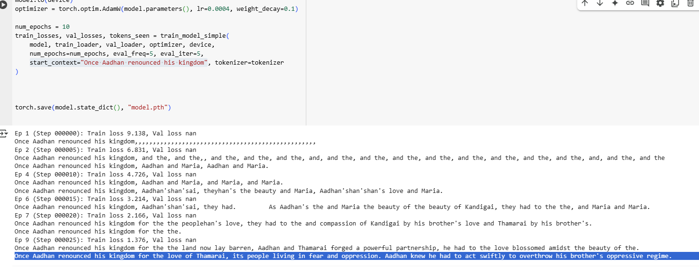

## How does LLM work ? - Part 5

### Lets build our own LLM

Now that we have come a long way understanding the Core Building Blocks of a Nano-Scale ChatGPT (Mini LLM),  lets try to build a simple one.

Lets recollect the building blocks which incudes the below 

| Component                      | Description                              |
| ------------------------------ | ---------------------------------------- |
| **Tokenizer**                  | Converts text to token IDs (e.g., using Byte-Pair Encoding or WordPiece) |
| **Embedding Layer**            | Converts token IDs into dense vectors    |
| **Positional Encoding**        | Adds sequence order info (Sinusoidal, Learnable, or Rotary) |
| **Multi-Head Self-Attention**  | Learns relationships between tokens in a sequence |
| **Feed-Forward Network (MLP)** | Applies nonlinear transformation to token representations |
| **Layer Normalization**        | Stabilizes training, applied pre/post attention and MLP blocks |
| **Residual Connections**       | Allows gradients to flow across layers (x + F(x)) |
| **Decoder Stack Only**         | For GPT-style models — stack of decoder blocks with causal masking |
| **Logits Layer (Output)**      | Linear projection to vocabulary size for next-token prediction |
| **Softmax**                    | Converts logits into probability distribution over tokens |

 Well, lets reuse some of the great work done by

 **Sebastian Raschka**

https://github.com/rasbt/LLMs-from-scratch

## LLM from Scratch – (`story_llm.py`)

Objective : 

Our objective here is have our LLM called STORY_LLM which learns from our story . If we give few words from our story, it will generate words of completions in a sequence. 

i.e if we give start_context="*Once Aadhan renounced his kingdom*" ......

our LLM should continue the story like  .**..`Once Aadhan renounced his kingdom for the love of Thamarai, its people living in fear and oppression. Aadhan knew he had to act swiftly to overthrow his brother's oppressive regime.                  `**

ok .. lets do it . While we have already covered most of the basics, would highly recommend to watch these ones from **Sebastian Raschka** or read his book Build a Large Language Model (From Scratch)

https://www.youtube.com/watch?v=quh7z1q7-uc

https://www.youtube.com/playlist?list=PLTKMiZHVd_2Licpov-ZK24j6oUnbhiPkm

------

#### 1. Install Dependencies

- Install required libraries like `tiktoken`, `matplotlib`, and `litgpt`.

#### 2. Load and Preprocess Text

- Load the short story (Short_Story).txt.
- Preprocess the text using regular expressions to split into tokens (words and punctuation).
- Build a vocabulary of unique tokens.

#### 3. Create a Simple Tokenizer

- Define a tokenizer class to encode (text → token IDs) and decode (IDs → text).
- Test the tokenizer with example text.

#### 4. Byte-Pair Encoding (BPE)

- Use OpenAI's `tiktoken` tokenizer (used by GPT-2) for more efficient and realistic subword tokenization.
- Encode and decode sample text using BPE.

#### 5. Data Sampling with Sliding Window

- Use a sliding window technique to create input–target pairs for next-token prediction.
- Each input is a sequence of tokens, and the target is the same sequence shifted by one token.

#### 6. Define GPT Model

- Build a decoder-only transformer (GPT-style) model with:
  - #### ➤ Embedding Layers:

    - `tok_emb`: Word/token embeddings
    - `pos_emb`: Positional embeddings
    - These are **added together** for each token.

    #### ➤ `TransformerBlock`:

    Each block contains:

    1. **LayerNorm**
    2. **Multi-Head Attention** (with causal mask):
       - Projects queries, keys, and values
       - Scales dot product of Q·Kᵀ
       - Applies causal mask (upper-triangular) to prevent attending to future tokens
       - Computes weighted sum with `V`
    3. **Feed Forward Network** (MLP):
       - 2-layer MLP with GELU activation
    4. **Residual Connection**:
       - Adds input to output after both attention and MLP
    5. **Dropout**:
       - Regularization applied to prevent overfitting

    #### ➤ Final Output:

    - `final_norm`: LayerNorm
    - `out_head`: Projects back to vocabulary size → logits

#### 7. Test Model with Sample Input

- Pass a batch of tokenized text through the untrained model to check output shapes.

#### 8. Generate Text with Greedy Sampling

- Implement a `generate_text_simple` function:
  - Feed in a start prompt
  - Autoregressively generate the next N tokens using `argmax`

#### 9. Evaluate Initial Loss

- Split the dataset into train and validation sets.
- Use a simple evaluation function to calculate the loss on each split before training.

#### 10. Train the Model

- Train using:
  - Cross-entropy loss
  - AdamW optimizer
  - Evaluation every few steps
- Track and log training and validation loss over time.

#### 11. Save the Model

- Save the model weights to a file after training completes.

#### 12. Plot Loss Curves

- Plot training and validation loss curves across epochs using `matplotlib`.

#### 13. Inference with Saved Model

- Reload the saved model weights.
- Use the `generate_text_simple` function to generate new text from a prompt.

    Raw Text  ──▶  Tokenize (regex & BPE)
              └─▶  Vocabulary + Token IDs
                           │
                           ▼
           Sliding Window Sequence Pairs
                           │
                           ▼
                 Train Mini-GPT (Transformer)
                           │
         ┌─────────────────┼────────────────┐
         ▼                 ▼                ▼
    Evaluate           Save Model      Generate Text
      Loss              Weights         via Greedy

Looks how our LLM has first struggled to form a meaningful sentence and eventually has learnt to write a sentence 

Please try yourself with our own data using the code here.

https://colab.research.google.com/drive/1KGtRkBfO5YR16BJTZ5eAgbixwX8wW_qP