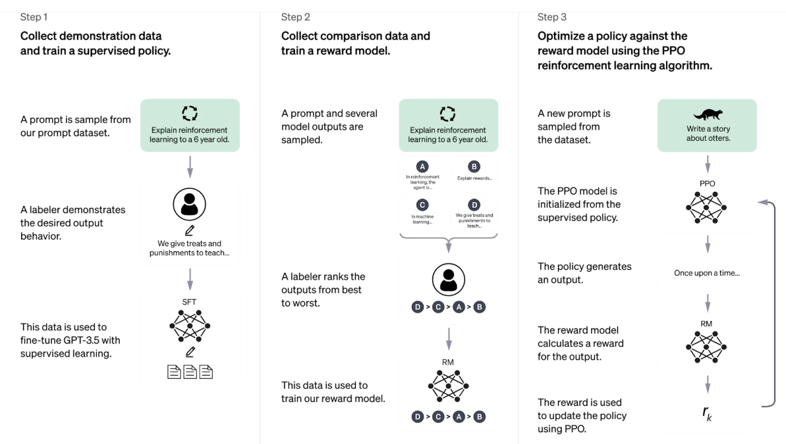
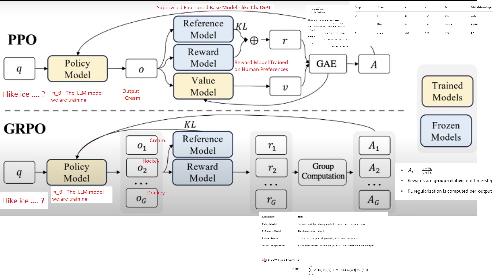

## How does LLM work ? - Part 6


### ChatGPT (PPO)  & Deep Seek (GRPO) 


**Lets start with ChatGPT**


ChatGPT:



This diagram illustrates how **ChatGPT is trained** using a three-step process called **Reinforcement Learning from Human Feedback (RLHF)**. Let's break it down:

------

#### Step 1: Supervised Fine-Tuning (SFT)

> 📌 Goal: Teach the model to produce helpful responses.

1. **A prompt is sampled** from a dataset (e.g., "Explain reinforcement learning to a 6-year-old").
2. **A human labeler writes a good response**, demonstrating what a good answer looks like.
3. **The model is fine-tuned** (GPT-3.5 or similar) using this human-written response through supervised learning.
   - This results in a base policy called **SFT model** (Supervised Fine-Tuned model).

------

####  **Step 2: Reward Model Training**

> 📌 Goal: Train a model to recognize better answers based on human preferences.

1. **Several model responses are generated** for the same prompt (e.g., A, B, C, D).
2. **A labeler ranks the responses** from best to worst (e.g., D > C > A > B).
3. **These rankings are used** to train a **Reward Model (RM)** that learns to score outputs based on how human-like or helpful they are.

------

#### **Step 3: Reinforcement Learning with PPO**

> 📌 Goal: Improve the model’s output based on the reward signal.

1. **A new prompt** is sampled (e.g., “Write a story about Tiger”).
2. The **PPO model**, initialized from the SFT model, **generates an output**.
3. The **Reward Model (RM)** scores the output.
4. This score (**reward** `r_k`) is used by the **PPO (Proximal Policy Optimization)** algorithm to **update the model's policy** — i.e., adjust the model to favor higher-scoring behaviors.
5. The process **loops**: generate → score → update.

------

#### 🎯 Summary

| Step                      | Purpose                            | Output              |
| ------------------------- | ---------------------------------- | ------------------- |
| 1. Supervised Fine-Tuning | Teach base behavior                | SFT model           |
| 2. Reward Model           | Learn human preference             | RM (Reward Model)   |
| 3. PPO Optimization       | Refine responses via reinforcement | Final ChatGPT model |


lets now compare with our Frozen Lake game we started with , just to see what are in common


## **Comparison: ChatGPT (RLHF) vs. Deep Q-Learning (FrozenLake)**

| **Aspect**               | **ChatGPT RLHF**                         | **Deep Q-Learning (FrozenLake)**         |
| ------------------------ | ---------------------------------------- | ---------------------------------------- |
| **Goal**                 | Learn to generate human-aligned, high-quality text responses. | Learn the optimal policy to reach a goal state in a grid while avoiding holes. |
| **Environment**          | Human feedback in the form of ranked responses (indirect reward signals). | A discrete grid-based environment with deterministic or stochastic transitions. |
| **State**                | The text prompt and generated tokens so far. | The agent’s current position in the grid (e.g., tile number). |
| **Action**               | Selecting the next token to generate.    | Choosing a direction: {Left, Right, Up, Down}. |
| **Policy**               | A language model that maps text prompts to responses. | A Q-network (NN) that maps states to Q-values for each action. |
| **Reward**               | Estimated by a **Reward Model** trained on human preferences. | +1 for reaching the goal, 0 otherwise, -1 for falling into a hole. |
| **Learning Method**      | **Proximal Policy Optimization (PPO)** — a policy-gradient method. | **Q-learning** — value-based method using Bellman updates. |
| **Exploration Strategy** | Implicit in PPO; exploration occurs via sampling outputs. | Epsilon-greedy (random exploration vs. exploiting best Q-value). |
| **Training Loop**        | - Generate responses using SFT model- Score with Reward Model- Update with PPO | - Observe state- Take action- Observe reward & next state- Update Q-values |
| **Memory**               | None in PPO by default (stateless); policy updated on-the-fly. | Uses a replay buffer to store and sample past experiences. |
| **Supervision Type**     | Combines **supervised learning** (SFT) with **reinforcement learning** (PPO via reward model). | Pure **reinforcement learning**; no supervised signal — rewards drive learning. |
| **Human Involvement**    | High — via preference ranking and demonstration collection. | None — fully simulated.                  |

#### Key Insights:

- **Reward Origin**:
  - In ChatGPT, **rewards are learned** via human preference rankings.
  - In FrozenLake, **rewards are hardcoded** in the environment.
- **Model Structure**:
  - ChatGPT uses a **language transformer** (decoder-only GPT).
  - DQN uses a **Q-network** (typically MLP or CNN for visual input).
- **Learning Algorithm**:
  - ChatGPT uses **policy optimization** (PPO).
  - FrozenLake uses **value iteration** with Q-learning.

------

#### 🔁 Summary Table of Flow

| Step | ChatGPT (RLHF)                         | FrozenLake (Deep Q-Learning)             |
| ---- | -------------------------------------- | ---------------------------------------- |
| 1    | Collect demonstrations (SFT)           | Initialize Q-table or Q-network          |
| 2    | Train reward model from ranked outputs | Define reward matrix from environment    |
| 3    | Generate response                      | Take action in the grid                  |
| 4    | Evaluate with reward model             | Get reward from environment              |
| 5    | Update model using PPO                 | Update Q-values using Bellman equation   |
| 6    | Repeat with new prompts                | Repeat over episodes and update Q-network |


The comparison is just for us to refresh and co-relate with the fundamentals of Reinforcement Learning,  

So, we now have something called Supervised Fine Tuning, a Custom Reward Model and a new Policy update algorithm called **Proximal Policy Optimization.**  

**Supervised Fine-Tuning (SFT)** is a process used to train or adapt a large language model (LLM) using **labeled input-output pairs** (like prompt → expected response) in a supervised learning setting.


**Pretraining vs SFT vs RLHF**


| Aspect                    | **Pretraining**                          | **Supervised Fine-Tuning (SFT)**         | **RLHF (Reinforcement Learning with Human Feedback)** |
| ------------------------- | ---------------------------------------- | ---------------------------------------- | ---------------------------------------- |
| **Goal**                  | Learn general language structure & knowledge | Teach specific behaviors or formats      | Align model responses with human preferences |
| **Training Data**         | Massive unlabeled corpus (books, websites, code) | Labeled prompt-response pairs            | Ranked model responses or preference scores from humans |
| **Learning Objective**    | Predict next token                       | Minimize loss on target outputs          | Maximize reward signal using PPO, DPO, or GRPO |
| **Loss Function**         | Cross-entropy (next-token prediction)    | Cross-entropy (output vs label)          | Policy gradient loss (e.g. PPO loss)     |
| **Example Prompt**        | – (unsupervised: just token prediction)  | "Translate: Hello → Hola"                | "Write a helpful response to this question:" |
| **Example Output**        | The → quick → brown → fox → ...          | "Hola"                                   | Response that is factually correct, polite, and useful |
| **Human Involvement**     | ❌ None                                   | ✅ Needed to create labels                | ✅ Needed to rank responses or give preference feedback |
| **Stage in Pipeline**     | 1️⃣ First step                           | 2️⃣ Second step                          | 3️⃣ Final step                           |
| **Real Dataset Examples** | Common Crawl, The Pile, BooksCorpus      | Alpaca, OpenAssistant, Dolly, ShareGPT   | OpenAI's InstructGPT comparisons, Anthropic HH-RLHF, OpenFeedback |
| **Example Use Case**      | General understanding of text, grammar, reasoning | Learn how to write emails, summarize text, fix bugs | Generate safe, helpful, non-toxic responses |


We will focus on Proximal Policy Optimization , the brain of the learning process to understand what it really does. That's the crux


#### What is PPO?

**PPO** is a policy-gradient reinforcement learning algorithm. It is used to train agents to **optimize their behavior** while making sure they don’t change their behavior too much at once.

> ✅ Think of PPO as a *cautious learner* that tries to get better but doesn't leap too far in one step.

------

#### 🍦 Real-Life Analogy – "Ice Cream Seller"

Imagine you're a street ice cream seller. Every day, you try new locations to increase your sales:

#### Step-by-step:

1. **Policy** = where you set up your cart.
2. You try a new park location (action).
3. You make **sales (reward)**.
4. You want to **improve your location strategy** based on feedback.
5. BUT — you don’t want to change your spot too drastically (e.g., moving from a busy park to a deserted alley) without certainty.

**PPO** helps you make improvements **only if they are not too extreme** compared to your current strategy.

------

#### 🤖 PPO in Reinforcement Learning

Let’s walk through how PPO works step-by-step using an RL example.

#### 🧊 FrozenLake Game Example

- The agent learns to walk across frozen tiles to reach a goal.
- If it falls into a hole, it gets a **negative reward**.
- If it reaches the goal, it gets a **positive reward**.

------

#### PPO Steps

##### 1. **Initialize Policy**

- Start with a basic policy π (a neural network).
- Let’s say the policy says “go left with 60% probability, right 40%”.

##### 2. **Collect Experience**

- Run the policy in the environment (FrozenLake).
- Record: `(state, action, reward, next_state, old_probability)`

##### 3. **Compute Advantage**

- Estimate how much better (or worse) an action was compared to the average:

  $A_t = r_t + \gamma V(s_{t+1}) - V(s_t)$

  ​

##### 4. **Update Policy with Clipped Objective**

Instead of directly using:

$L(\theta) = \frac{\pi_\theta(a_t|s_t)}{\pi_{\theta_{\text{old}}}(a_t|s_t)} A_t$

PPO uses a **clipped version** to avoid large updates:

$L^{\text{CLIP}}(\theta) = \min\left(r_t(\theta) A_t, \text{clip}(r_t(\theta), 1 - \epsilon, 1 + \epsilon) A_t \right)$

Where:

- $r_t(\theta) = \frac{\pi_\theta(a_t|s_t)}{\pi_{\theta_{\text{old}}}(a_t|s_t)}$
- ϵ is a small number like 0.2

 This ensures the update doesn’t deviate too far from the original policy.

##### 5. **Repeat**

- Continue updating the policy using mini-batches from experience.
- Evaluate and iterate until convergence.


          +---------------------+
          | Initial Policy πθ   |
          +---------------------+
                    |
                    v
        +-------------------------+
        | Collect Trajectories   |
        | (state, action, reward)|
        +-------------------------+
                    |
                    v
        +-------------------------+
        |   Compute Advantage     |
        | A_t = Better/Worse      |
        +-------------------------+
                    |
                    v
        +----------------------------------+
        |    Update Policy using PPO      |
        |  Clip( π_new / π_old, 1±ε ) * A |
        +----------------------------------+
                    |
                    v
        +-------------------------+
        |   New Improved Policy   |
        +-------------------------+
                    |
        Repeat ⟲ until converged
------

#### ✅ Key Benefits of PPO

| Feature                     | Benefit                                  |
| --------------------------- | ---------------------------------------- |
| Clipped updates             | Stability in training                    |
| No second-order gradients   | Simpler than Trust Region Policy Optimization (TRPO) |
| Sample efficiency           | Reuses data via multiple epochs          |
| Works well with neural nets | Used in ChatGPT, Robotics, Games         |


Let’s break down the **Proximal Policy Optimization (PPO)** algorithm using the sentence completion example:


> **Prompt**: `"I like ice ___"`
> **Choices**: `"cream"`, `"hockey"`, `"donkey"`
> **Goal**: Learn to pick the best word (`"cream"`) over time
> **Rewards**:
>
> - `"cream"` → +10
> - `"hockey"` → +5
> - `"donkey"` → -10

------

#### 🧠 PPO: Step-by-Step Explanation with Example

------

#### **Step 1: Define the Policy**

The model’s **policy** is its current belief about which word is best.

🧾 Example:At the start (untrained), the model might have:

```

π_old = {
  "cream": 0.33,
  "hockey": 0.33,
  "donkey": 0.33
}

```

------

#### **Step 2: Sample an Action**

The model samples one word based on the current policy distribution.

🧾 Let's say it picks `"hockey"`.

------

#### **Step 3: Get a Reward**

We give the model feedback (reward) based on its choice.

🧾 Reward for `"hockey"` = **+5**

------

#### **Step 4: Estimate the Advantage**

The **advantage** tells us: was this action better than average?

Let’s say the model’s value estimate for this state was **3.0**.

$A = r - V(s) = 5 - 3 = +2$


------

#### **Step 5: Compute the New Policy**

After a few updates, the model generates a new policy:

```

π_new = {
  "cream": 0.50,
  "hockey": 0.40,
  "donkey": 0.10
}

```

It’s increasing `"cream"` and `"hockey"` and decreasing `"donkey"`.

------

#### **Step 6: Compute the PPO Ratio**

The ratio compares how much more (or less) the new policy likes the action:

$r = \frac{\pi_{\text{new}}("hockey")}{\pi_{\text{old}}("hockey")} = \frac{0.40}{0.33} ≈ 1.21$


------

#### **Step 7: Clip the Ratio**

We don’t want to allow `r` to be **too far** from 1 (to avoid huge jumps).

We clip it between `1 - ε` and `1 + ε` (typically `ε = 0.2`):

r=1.21

ϵ=0.2

${clip}(r, 1 - \epsilon, 1 + \epsilon) = \text{clip}(1.21, 0.8, 1.2) = 1.2$

That means **we accept the improvement**, but cap it if it’s too big.

------

### **Step 8: Update the Policy**

Now, we **update the policy weights** to increase the chance of `"cream"` and `"hockey"` if they had a positive advantage.

This is repeated over thousands of samples.

------

#### Final Outcome

Over many iterations, the model learns:

```

π_final = {
  "cream": 0.96,
  "hockey": 0.03,
  "donkey": 0.01
}

```

**"cream"** dominates — because it consistently yielded the highest rewards.

------

####  Why PPO Works Well Here:

| Feature         | How it Helps in This Example             |
| --------------- | ---------------------------------------- |
| Clipping        | Prevents overconfidence in early updates. |
| Advantage       | Focuses learning only on meaningful changes. |
| Policy Gradient | Learns to shift probabilities, not hard rules. |


#### **Lets move to  Deep Seek (GRPO)**


Let’s extend the `"I like ice ___"` example to explain **Group Relative Policy Optimization (GRPO)** — a variant of PPO that is designed for **relative preference learning** (like ranking or choosing the best among a set), often used in **LLMs** (like ChatGPT finetuning with human feedback).

------

#### 🤖 Scenario Recap

**Prompt**: `"I like ice ___"`
**Candidate completions**:

- `cream`: ⭐ Very relevant → Reward: 10
- `hockey`: 👍 Somewhat okay → Reward: 5
- `donkey`: 👎 Irrelevant → Reward: -10

------

#### 🎯 What is GRPO?

GRPO (Group Relative Policy Optimization) is an **RL algorithm that compares multiple completions** for the same prompt and:

- Assigns **relative scores** (not absolute rewards),
- Uses the **difference in scores** within the group to update the model,
- Learns which completions are relatively **better or worse**.

🔁 Instead of evaluating **each choice independently** like PPO, **GRPO evaluates them as a group**.

------

#### 🧠 Key Idea of GRPO

1. Generate **N completions** for the same input (e.g., `"I like ice ___"` → ["cream", "hockey", "donkey"])

2. Compute **reward** for each (could come from a human or a reward model)

3. Compute the **relative advantage** of each completion within the group:

   ​	$A_i = \frac{r_i - \text{mean}(r)}{\text{std}(r) + \epsilon}$


1. Use this **standardized advantage** to update the policy **only for these completions**.

------

#### 🧊 GRPO Walkthrough: “I like ice ___”

#### 🎲 Step 1: Generate completions

```

"cream", "hockey", "donkey"

```

#### 🎁 Step 2: Assign rewards

```

[10, 5, -10]

```

#### 🧮 Step 3: Compute relative advantages

Let’s standardize them:

- $Mean = \frac{10 + 5 + (-10)}{3} = 1.67310$
- Std Dev = approx 10.41

Advantage  cream $ = \frac{10 - 1.67}{10.41} ≈ 0.80$

Advantage hockey $= \frac{5 - 1.67}{10.41} ≈ 0.32$


Advantage donkey $=  \frac{-10 - 1.67}{10.41} ≈ -1.12$

Now we know:

- "cream" is **most preferred**
- "donkey" is **least preferred**

#### 🔁 Step 4: Update policy using those **relative advantages**

Instead of using:

$r = \frac{\pi_{\text{new}}(a)}{\pi_{\text{old}}(a)}$

like PPO,

We apply:

$L^{\text{GRPO}} = -A_i \cdot \log \pi(a_i)$

for each completion $a_i$ in the batch.

------

#### 🔍 How It Differs from PPO

| Aspect    | PPO                                    | GRPO                                     |
| --------- | -------------------------------------- | ---------------------------------------- |
| Input     | One (state, action, reward) per update | Multiple completions per prompt          |
| Reward    | Absolute (based on environment or RM)  | Relative (ranking or normalized group reward) |
| Use case  | Classical RL tasks                     | Text generation, ranking completions (LLMs) |
| Advantage | Single reward-based                    | Group-standardized (z-score-like)        |

------

#### ✅ Why GRPO is Great for LLMs

- Useful when absolute reward signals are noisy or inconsistent.
- Learns from **human preference rankings** (e.g., “A is better than B”).
- Encourages better **intra-group differentiation**.


Lets compare the formula for PPO and GRPO




### **PPO vs GRPO: Side-by-Side Comparison**

| Aspect                    | **PPO (Proximal Policy Optimization)**   | **GRPO (Group Relative Policy Optimization)** |
| ------------------------- | ---------------------------------------- | ---------------------------------------- |
| **Training Setup**        | One prompt → one output → one reward     | One prompt → multiple outputs → group of rewards |
| **Reward Type**           | Absolute reward per sample (scalar)      | Relative rewards within a group (standardized) |
| **Advantage Estimation**  | Uses **Value model** + GAE to estimate advantage | Uses **group-level normalization**: $A_i = \frac{r_i - \mu}{\sigma}$ |
| **Value Model**           | ✅ Required                               | ❌ Not required                           |
| **KL Divergence**         | Used to prevent policy from drifting from reference | Used per output (KL with reference model) |
| **Reference Model**       | Used for KL divergence or clipping       | Same — used to anchor policy behavior    |
| **Sampling**              | Single trajectory per prompt             | Group of completions per prompt          |
| **Common Use Case**       | Online fine-tuning, interactive tasks (e.g., RLHF for ChatGPT) | Static preference learning, reranking, fine-tuning with offline data |
| **Learning Stability**    | Sensitive to value estimation errors     | More robust to noisy rewards             |
| **Reward Model Training** | Needs labeled data or trained from pairwise preferences | Can be inferred from rankings, corpus frequencies, or comparisons |
| **Policy Loss**           | Based on clipped probability ratio + advantage | Based on log-probabilities weighted by standardized advantage |
| **Typical Application**   | Game-like environments, ChatGPT RLHF     | Group-based tuning of LLMs from preference datasets (e.g., Direct Preference Optimization variants) |

------

### ✅ TL;DR

| PPO                    | GRPO                      |
| ---------------------- | ------------------------- |
| Reward is **absolute** | Reward is **relative**    |
| Needs **value model**  | No value model needed     |
| Uses **one output**    | Uses **multiple outputs** |


Code: https://colab.research.google.com/drive/1xEwRySIBbm9Hmhk2doNhQxZOjKlYUHAu#scrollTo=7s9WPlwtAcA2

Code: https://colab.research.google.com/drive/1-DXoIrfS3OixbRFvCF3IFZS72RL2E6pY?authuser=1#scrollTo=-S9OL7aat0gz