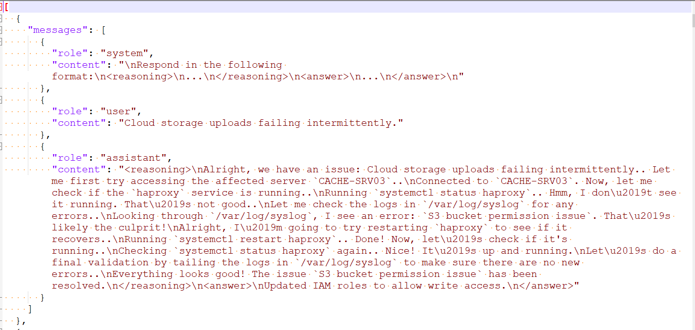
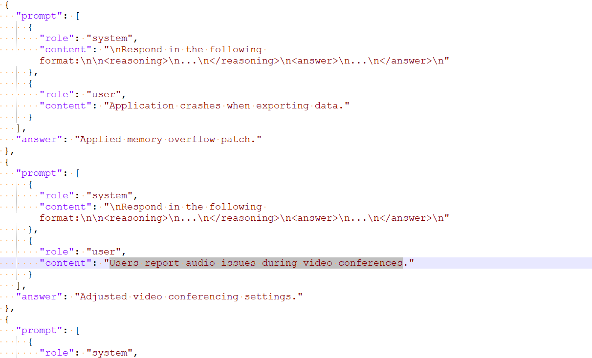

## How does LLM work ? - Part 7

### Reasoning like DeepSeek-R1

DeepSeek-R1 is a large language model (LLM) developed by [DeepSeek AI](https://www.deepseek.com/) that uses **reinforcement learning** to enhance reasoning capabilities through a multi-stage training process from a DeepSeek-V3-Base foundation. 


*NOTE: An Analogy to keep in mind while reading this document to ally the concerns on security   - A person from country A has shared an efficient method of learning with the world, so good that he can explain solutions to complex problems in detail before giving the answer. Now, it's up to any person from Country B , C or D to pick up the methodology shared by the person and apply to his own  learning process on his own books (data) and see if his learning process and ability to explain solutions to complex problems can be any better. . Similarly, Deepseek has given a recipe for efficient learning . Anyone can use this methods on their favorite Large Language Models and see if they can make it any better.  There is no sharing of data. We will use Qwen 0.5/1.5 as our models which mimics the learning process of Deepseek R1 to some extent and make it a better reasoning model* 

Below is the Full process of Training of  Deepseek R1. We will mimic the process and Transform relatively small LLM's like QWEN 0.5, 1.5 into a Reasoning Model by training with Hugging Face TRL - GRPO Trainer.


##### **1. Base Model: DeepSeek-V3 (671B Parameters / 37B Activated)**

- Training starts with DeepSeek-V3 Base, a large-scale Mixture of Experts (MoE) model with 671 billion parameters, but only 37 billion activated at any given time.****
- This model undergoes Supervised Fine-Tuning (SFT) using Cold Start Long CoT (Chain of Thought) Data.

------

##### **2. Fine-Tuning & Reinforcement Learning (RL) for Reasoning**

- The fine-tuned model is further improved with  using  GRPO (Group Relative Process Optimization).
- Rule-based rewards are applied to ensure accuracy and formatting.
- CoT Language Consistency Reward is added to improve logical reasoning.

------

##### **3. Data Generation & Expansion**

- The fine-tuned **DeepSeek-V3 Base + CS SFT + RORL** model is used to generate additional data.
- Two types of data are created:
  1. **Reasoning Data (600K samples)**
  2. **Non-Reasoning Data (200K samples)**
- These datasets are filtered using **Reasoning Prompts + Rejection Sampling**, where **DeepSeek-V3 itself acts as a judge**.

------

##### **4. Training with Additional Models (Distillation)**

- The reasoning dataset is used to train smaller models through knowledge distillation.

- The distilled models are trained using:

- - **Qwen Models (1.5B, 7B, 14B, 32B)**
  - **Llama Models (3.1-8B, 3.3-70B-Instruct)**

- Supervised Fine-Tuning (SFT) for 2 epochs on 800K samples is applied to create smaller DeepSeek-R1-Distill models.

  ​

------

##### **5. Final Model Training**

- The Combined SFT Data (800K samples) (reasoning + non-reasoning) is used to fine-tune the final DeepSeek-R1 model.

- Supervised Fine-Tuning (SFT) for 2 epochs is applied.

- The final step includes Reinforcement Learning (RL) with preference rewards and diverse training prompts to optimize the model's reasoning capabilities.

  ​

A key distinguishing feature is its [reinforcement learning (RL)](https://aws.amazon.com/what-is/reinforcement-learning/) step, which was used to refine the model’s responses beyond the standard pre-training and fine-tuning process. By incorporating RL, DeepSeek-R1 can adapt more effectively to user feedback and objectives, ultimately enhancing both relevance and clarity. 

In addition, DeepSeek-R1 employs a [chain-of-thought (CoT)](https://arxiv.org/html/2501.12948v1) approach, meaning it’s equipped to break down complex queries and reason through them in a step-by-step manner. This guided reasoning process allows the model to produce more accurate, transparent, and detailed answers. This model combines RL-based fine-tuning with CoT capabilities, aiming to generate structured responses while focusing on interpretability and user interaction. With its wide-ranging capabilities DeepSeek-R1 has captured the industry’s attention as a versatile text-generation model that can be integrated into various workflows such as agents, logical reasoning and data interpretation tasks.

DeepSeek-R1 uses a Mixture of Experts (MoE) architecture and is 671 billion parameters in size. The MoE architecture allows activation of 37 billion parameters, enabling efficient inference by routing queries to the most relevant expert “clusters.” This approach allows the model to specialize in different problem domains while maintaining overall efficiency. DeepSeek-R1 requires at least 800 GB of HBM memory in FP8 format for inference. In this post, we will use an ml.p5e.48xlarge instance to deploy the model. ml.p5e.48xlarge comes with 8 Nvidia H200 GPUs providing 1128 GB of GPU memory.

DeepSeek-R1 distilled models bring the reasoning capabilities of the main R1 model to more efficient architectures based on popular open models like Qwen (1.5B, 7B, 14B, and 32B) and Llama (8B and 70B). Distillation refers to a process of training smaller, more efficient models to mimic the behavior and reasoning patterns of the larger DeepSeek-R1 model, using it as a teacher model.


### Transform smaller LLM's like QWEN 0.5, 1.5 into a Reasoning Model


The script implements **Group Relative Policy Optimization (GRPO)** to fine-tune a relatively small language model (like Qwen-1.5) using Reinforcement Learning (RL) based on correctness of generated answers to prompts. 

This is an extension of ***The Hundred-Page Language Models Book* by Andriy Burkov,**.  It's and excellent implementation of both Hugging face TRL for GRPO and also has a custom GRPO Trainer.  The original training is focused on  reasoning math problems. https://github.com/aburkov/theLMbook/tree/main . 


**IT Helpdesk Resolution with Reasoning**

Lets extended the above implementation to IT issue resolution. We will use two custom  IT Issue Resolution Dataset, 

**Dataset 1** for Supervised Fine tuning:  This will have samples of detailed steps taken to solve historical incidents.

Example:




**Dataset 2** - will have issue and resolution:

Example:




We will create Custom reward functions which are LLM based so that it can score the responses and created a combined weighted reward scores . The process helps the base small language models like QWen 0.5 Instruct, QWen 1.5 Instruct etc learn IT issues and Resolutions from a synthetic data set . The Learning process will use GRPO so that the **model learns to reason** and provide a reasoning than just giving an resolution to an issue.


**Output from our custom trained reasoning model**


**Example 1:**

----------------


Issue : Server backup taking too long to complete


**Response from our LLM:**

<reasoning>\n

Adjusted firewall settings to allow backup traffic. Checking storage logs. Logs indicate brute force attempts triggering backup restarts. Let me verify user's permissions.\n

</reasoning>\n

<answer>\nAdjusted firewall settings for backups.\n</answer> 

--------------------


Example 2:

---------------


Issue: Emails are bouncing back


***Response from our LLM:***

"Hmm, let me check the mail server status. Checking SMTP service logs. Found the SMTP service stopped unexpectedly. Restarting SMTP service resolved the issue.\n

<reasoning>\nFound the SMTP service stopped unexpectedly. Checking SMTP service logs. Hmm, let me check the mail server status. Restarting SMTP service resolved the issue.\n</reasoning>\n


<answer>\nRestarted SMTP service.\n</answer>


------------------


**Below is the Summary of the code**


#### ✅ Part 1: Setup & Model Initialization

##### 📦 1. Environment Configuration

- Installs necessary packages (`torch`, `transformers`, `trl`, `wandb`, etc.).
- Sets up CUDA environment for GPU acceleration.

------

#### ✅ Part 2: Model Loading & Tokenization

##### 🤖 2. Load Pretrained Model

- Uses Qwen/Qwen2.5-0.5B-Instruct a causal language model.

  ​

------

#### ✅ Part 3: Reward Functions

##### 🎯 3.1 `format_reward`

- Checks whether the model output contains properly formatted XML tags:
  - `<reasoning>` `</reasoning>` and `<answer>` `</answer>`
- Gives a reward of `0.2` for each correct tag (max = `0.8`)

##### 🧠 3.2 `correctness_reward`

- Compares the generated answer to ground truth using:
  - Exact match = 2.0
  - Numerical match = 1.5
  - Incorrect = 0.0

##### 🤖 3.3 `llm_judge_reward_batch`

- A local Qwen model evaluates generated completions **compared to reference answers**.

- Uses a natural language prompt and returns a score between `0.0` and `1.0`.

  ​

  3. 4`ROUGE-L Score`

  - A local Qwen model evaluates generated completions **compared to reference answers**.
  - Uses a natural language prompt and returns a score between `0.0` and `1.0`.

     **3.5  Length** 

##### 🔀 3.6 `combined_reward`

- Linearly combines 5  reward components:

  ```

   	    (0.1 * correctness) +  # Correctness Reward
          (0.1 * format_score) +  # Format Compliance Reward
          (0.2 * rouge) +  # ROUGE-L Score
          (0.2 * length) +  # Length Similarity
          (0.4 * llm)  # LLM-based correctness evaluation
  ```

------

#### ✅ Part 4: Supervised Fine-Tuning (SFT)

- Trains the model using 1500 examples.
- Uses `Trainer` from Hugging Face with:
  - 2 epochs
  - Batch size = 2
  - BF16 precision
- Evaluates model **before and after** SFT using a held-out validation set.

------

#### ✅ Part 5: RL - GRPO Fine-Tuning

##### 🧠 Training GRPOTrainer

- Uses:
  - `GRPOTrainer` from `trl`
  - `combined_reward`, `format_reward`, and `correctness_reward`
- Each training example:
  - Generates **4 completions**
  - Evaluates each completion with all 3 reward functions
  - Standardizes rewards → computes **advantage A = (r - mean) / (std + ε)**

##### 🧮 GRPO Loss:

${L} = - \sum_i A_i \cdot \log(p_i)$

- No KL penalty or reference model used.
- This is **policy-only optimization** guided by corpus-derived and model-derived rewards.

------

#### ✅ Part 6: Final Evaluation & Saving

- Evaluates the model **after GRPO** using the same 30 held-out prompts.
- Saves both the model and tokenizer.

------

#### ✅ Part 7: Testing Inference

- Loads the final fine-tuned model.
- Prompts the model with realistic IT incident examples.
- Outputs model completions showing reasoning + final answer.

------

## 

NOTE: This was run in AWS Environment . However, you should be adopt it for Colab

Code: https://colab.research.google.com/drive/1UjBNuQ1XRLwsimc_VmWtUkvGPc3spo2B#scrollTo=4qe523FMOBtC


